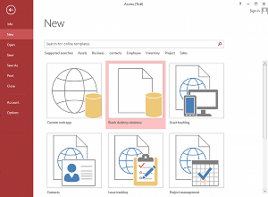

# Access教程

此Microsoft Access教程的目的是为愿意学习如何使用Microsoft Access。这里假定数据库以及它们如何工作有一个基本的了解。

如果你现在还没有理解数据库是如何工作，不要绝望 - 我们写了一个基本的数据库教程！该教程涵盖了数据库的基本概念，并使用Microsoft Access实例，这样会让你更容易理解。

## 教程目录

本教程由以下目录：

1.  [关于Microsoft Access](http://www.yiibai.com/access/about_microsoft_access.html)
2.  [创建数据库](http://www.yiibai.com/access/create_a_database.html)
3.  [创建一张表](http://www.yiibai.com/access/create_a_table.html)
4.  [添加数据](http://www.yiibai.com/access/adding_data.html)
5.  [创建表单](http://www.yiibai.com/access/create_a_form.html)
6.  [修改表单](http://www.yiibai.com/access/modify_a_form.html)
7.  [创建一个查询](http://www.yiibai.com/access/tutorial/create_a_query.html)
8.  [修改一个查询](http://www.yiibai.com/access/modify_a_query.html)
9.  [SQL视图](http://www.yiibai.com/access/sql_view.html)
10.  [创建一个宏](http://www.yiibai.com/access/tutorial/create_a_macro.html)
11.  [导出Access数据库到Excel](http://www.yiibai.com/access/export_access_database_to_excel.html)

