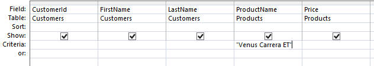
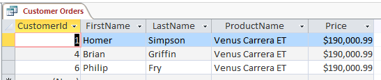
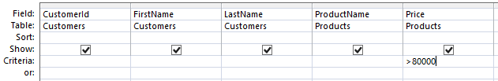
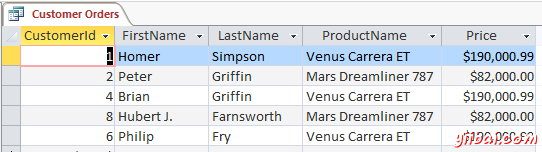
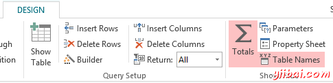
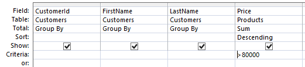
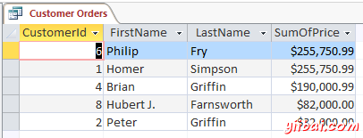

# Access修改查询 - Access教程

我们前面创建的查询返回所有在我们的数据库中订购产品的客户。 现在，我们将看看我们是否可以在这里调整查询一点点，还有，看看有什么其他的结果可以返回。

## 产品名称

市场部希望看到是否有人订购其最昂贵的太空飞船。所以，让我们回到所有客户购买最昂贵的太空飞船的名单 -  "Venus Carrera ET".

1.  从设计来看，在底部窗格中，输入 "Venus Carrera ET" （包括双引号）到ProductName字段的Criteria字段： 
2.  单击功能区的运行（Run）按钮来查看查询的结果。或者可以直接点击数据表视图图标。而这里的结果： 
3.  一旦满意结果，返回到设计视图，并删除你的修改 (即从Criteria字段中删除“Venus Carrera ET”).

## 价格

您还可以修改查询，以便它返回在一定的价格购买了产品的客户。

因此，让我们构建一个返回购买任何产品的所有客户查询，价格大于 $80,000.

1.  从设计来看，在底部窗格中，添加（&gt;80000）到Price 字段的条件字段： 
2.  单击功能区的运行(run)按钮来查看查询的结果。 或者，你可以直接点击数据表视图图标。这里是结果： 

## 价格总计使用

前面的查询都是没有问题的， 但是有一个（潜在的）问题的。虽然它确实让我们看到了所有购买的产品超过$80,000的客户，但它并没有真正绘制的全貌。 它不会显示谁可能已经购买多个产品，其中有一些是小于80000美元，但其中的总超过$80,000的客户。

下面演示我们如何可以捕获一个。

1.  从设计视图，单击功能区中的合计按钮： 
2.  现在，您将看到在底部窗格中总计（Total）行。每字段都会有分组（Group By）在该Price字段，单击分组（Group By ）并选择求和。
3.  点击下一行向下（即排序字段），并选择降序。保持price字段在&gt;80000标准。
4.  您还需要通过选择并单击删除列（旁边功能区上的合计按钮）删除产品名称列。它现在应该是这样的： 
5.  Run the query. And here are our big spenders: 

你可以花一些时间调整这一个简单的查询。例如，这里有一些想法：

*   你可以用&gt;=80000替换&gt;80000
*   你可以完全移除&gt;80000
*   您可以通过客户ID进行排序
*   您可以使用&gt;50000并且&lt;80000（或其他任何价位）
*   还有更多...

一旦完成，你可以保存新的查询或保持原来的查询。 宏课程的目的是让你可能想保持原有的查询。但是，您可以随时创建和保存多个查询，如果你喜欢这样做也是可以的。

所以你可以看到，查询可以非常强大。想象一下，如果你有数据库的详细表（和数据）。

