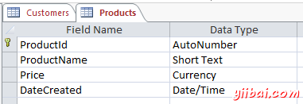
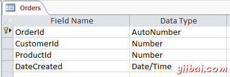
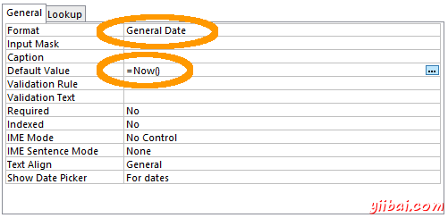
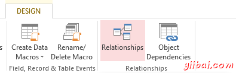
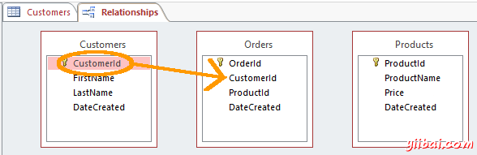
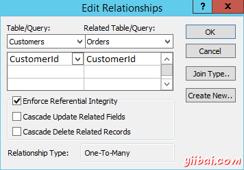
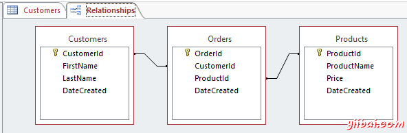

# Access创建关联关系 - Access教程

关系数据库的一个主要特点是，它们包含多个表，其中每一个可具有与其他表的关系。到目前为止，我们只创建了一个表，这是一个有点困难尝试建立与另一个表的关系时，只能是在同数据库中的表！

我们的数据库需要一个以上的表，无论如何，因为我们需要能够跟踪不仅客户还要产品，以及购买产品的实际顾客。

因此，让我们创建两个表，并建立它们之间的关系。一个表将存放产品信息，其他将存放订单信息。

## 创建相关的表

继续创建两个表如下。

一定要设置格式和默认值在两个表中的dateCreated字段（用户不需要进入这个字段- 系统可以做到这一点）。

### 主键

请记住，关键图标表示该字段是主键。主键可确保在此字段中的数据是唯一的 -  不允许哪两个值可以是相同的。一个表必须有一个主键的关系，可以用另一个表建立之前。 进入自动设置ID字段作为主键，所以只要你只需重命名ID为ProductId (或OrderId 视情况而定) 它将已是一个主键。如果由于某种原因，你的表中没有设置一个主键，或者如果你想改变主键字段，可以简单地右键点击（在设计视图）字段标题上，然后从上下文菜单中的主键。

## 建立关系

现在，你已经创建了两个额外的表，我们的数据库中有三个表。现在应该创建三个表之间的关系。

1.  在查看在设计视图表，并确保设计选项卡中选择，请从功能区点击关系（Relationships）： 
2.  一个显示表对话框会弹出，显示所有三个表。选择所有然后单击添加： 
3.  点击关闭按钮关闭对话框
4.  现在，您将看到三个方框代表三个表。单击并拖动Customers表的客户ID根据给Orders表中相应的客户ID字段： 
5.  编辑关系对话框会弹出。按此实施参照完整性，以便它被选中。检查值如下面的截图是一样的，然后单击Create：  现在，您将看到Customers表的客户ID字段和订单表的客户ID之间建立一条线。
6.  现在做相同操作在Products表。也就是说，单击并关系相应的ProductID字段从Products表拖动的ProductId 到Orders表。表之间的关系看起来应该像下面的截图： 

## 关系类型

我们刚刚建立了许多一对多的关系。有三种类型的关系可以在表之间建立的。这些如下：

**多对多的关系**

这就是我们上面的例子使用的。在表A 的行可以在表B中使用关联，反之亦然许多匹配行。 在我们的例子中，一个客户可以订购多种产品，单品可以有很多客户。使用第三个表一个创建多一对多的关系，所谓结合表（更多关于该下文）。

**一对多的关系**

这是最常见的关系类型。并不需要第三个（结联）表这种类型的关系。在这种类型的关系，一行记录在表A中可具有表B中许多匹配的行， 但表B中的行只能有一个匹配行在表A中. 例如，行在性别表（包含记录男性和女性）可以在一个客户表中的多个匹配的行，但客户表的行只能有一个匹配行在性别表。也就是说，除非有，允许客户为男性和女性的业务规则。 在这种情况下，一个多对多的关系将需要建立。

**一对一的关系**

在表A中的一行只能有一个匹配行在表B中，反之亦然。这不是一个普通的关系类型，如表B中的数据可以只是很容易地在表A中对应.这种关系式一般只用于安全目的，或将一个大表，也许几个其他原因。

使用的关系的类型取决于表结构以及如何字段定义。

## 交结表

另外，在上述关系中，订单表被称为一个结合表。结合表是一个包含来自两个或更多个相同的数据库内的其它表的共用字段。它被用作一个基准表在多对多的关系（如我们正在做在的例子）中。

交结表在许多不同的名称。 这里有一些：交叉引用表，表桥，连接表，映射表，交表，链接表，多到很多解析器，链接表，表配对，数据透视表，转换表，或关联表。

所以，如果你曾经听到有人提到其中的一个，你应该知道它们指的是什么。

## 主键VS外键

我们已经知道，一个主键确保了在该字段中的数据是唯一的。这是重要的，因为我们的订单表的需要，以引用任何记录从其他表的唯一值。例如，它不能使用名字字段，因为可能有超过一个人使用一个给定的名字。它不能使用dateCreated的值，因为它可能是两个记录可在完全相同的时间被创建（例如，如果两个操作者都输入数据，或者如果多条记录从外部源导入）。这就是为什么我们需要在至少一个字段中，只包含一个唯一的值。

外键是简单地在相关表中的相应字段的主键。 所以在我们的例子中，在Orders表客户ID字段是外键，而在客户表中的客户ID字段是主键。 同样，在订单表中的ProductID字段是一个外键，而产品表产品id字段是主键。该字段并不一定需要具有相同的名称，这是一个很好的做法。这必将使数据库结构更容易理解 - 尤其是当你开始添加多个表也需要有确定的关系。

## 关系和查询

创建像上面的一个关系可以帮助对数据库建立查询。接下来，我们将使用我们的新创建的关系，帮助我们创建对表在数据库中查询。

