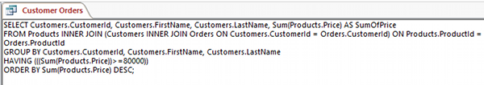

# Access SQL视图 - Access教程

我们创建和修改的查询均在设计视图中完成。这是一个友好的用户界面，使您可以通过可视化查询中使用的表和其提供给的选项很容易地创建查询。

但每当你使用设计视图构建查询，在后台，MS访问被构造SQL语句，以使其查询工作。 对于您创建的每个查询，都有一个SQL语句隐藏在后台。

其实它也不是很“藏”......毕竟，你可以查看它在任何时间。要做到这一点，只需要进入SQL视图。

## 切换到SQL视图

要切换到SQL视图，只需单击SQL图标访问的右下角：


_**注：**也可以从功能区的左上角的查看图标选择SQL视图。_

## SQL语句

一旦在SQL视图中，您将看到一个SQL语句。这个SQL语句表示您构造查询。下面是我们执行的最后一个查询的SQL视图：


如果不熟悉SQL，这可能看起来有点吓人。但是它不需要是这样的。该SQL语句简单地从数据库中使用我们的精确标准提取记录。

让我们来看一个不太复杂的SQL语句：

```
SELECT Customers.FirstName, Customers.LastName 
FROM Customers
```

上面的SQL语句返回Customers表的名字和姓氏字段。它返回所有记录，因为我们这里没有另行指定。

如果我们想要指定只有一些记录，我们需要一些标准添加的语句。下面是修改后的声明：

```
SELECT Customers.FirstName, Customers.LastName 
FROM Customers
WHERE Customers.LastName = 'Griffin'
```

像第一个例子，上面的SQL语句返回Customers表的名字和姓氏字段。但在这个例子中，我们只返回其中客户的姓氏是 "Griffin" 的记录。

正如你所看到的，每次添加标准，在设计视图查询时，这一标准被添加到SQL语句中，我们可以通过只精确的记录，我们感兴趣的限制结果。

这些都是简单的例子来说明如何SQL工作。随意调整在设计视图的查询，并切换到SQL视图来看看它是如何改变SQL语句。如果你有兴趣了解更多关于SQL用法，请检看[SQL教程](http://www.yiibai.com/sql/)。

