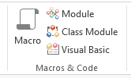
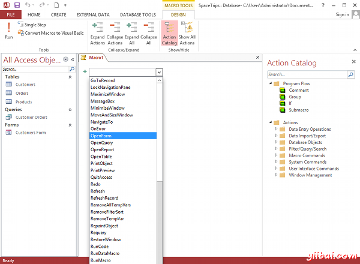
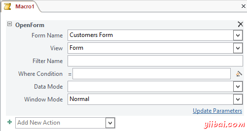
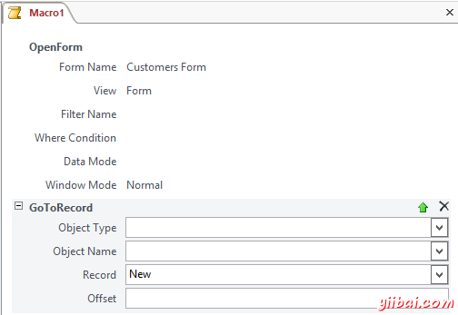
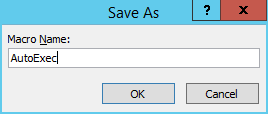
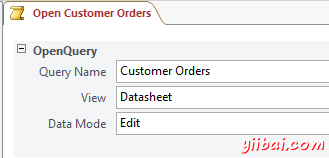
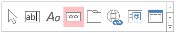
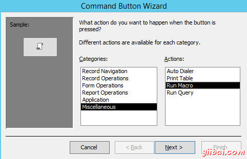
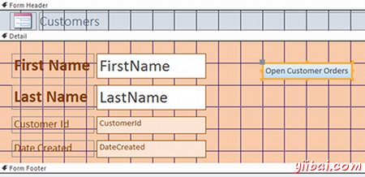

# Access创建宏 - Access教程

微软Access提供创建宏的能力。宏是指一组的可自动运行的动作，并在需要时。宏通常被配置为发生特定事件发生时运行。您可以在创建宏时指定事件是什么。你可以做一个宏运行，当用户按下某个键，或者你可以做一个宏在每次你打开数据库时运行。

## Macro 示例

举例来说，如果说90%的数据库使用的是进入新客户到客户表单，可以创建一个自动打开窗体每次打开数据库时宏，并跳转直接到新的记录。这样做会不必每次查找表单，双击它， 然后再次单击以跳转到一个新的记录，在每次打开数据库时。

以下你可以去创建一个宏：

1.  确保创建(Create)选项卡从功能区选中，单击Macro： 
2.  使用下拉菜单选择第一个操作 - 选择 OpenForm: 
3.  在底部窗格中，选择您要打开的窗体名称 - 选择 Customers Form (我们唯一的表单)： 
4.  使用下拉菜单选择第二个动作 - 选择GoToRecord。在记录字段中，选择想要去记录- 选择 New。我们在这里所做的就是确保表单不打开一个以前的记录 - 它直接到结束有一个空白记录为你准备好进入一个新的纪录（这样可以节省时间和不必要的点击）： 
5.  准备好，以保存您的宏。 点击保存图标并输入宏的一个名称。请确保这个宏的名字为：AutoExec。 通过命名Autoexec，我们指示访问运行该宏在每次打开数据库时。 

## 测试你的宏

现在，我们已经创建了宏，现在来测试它。要做到这一点，应该关闭我们的数据库，然后再次打开它。 当我们打开它，Customers表单自动打开，并准备将进入一个新的纪录。

关闭数据库，从功能区单击文件（file）选项卡，然后单击关闭(close)。

还可以通过对宏打开宏选项卡，然后双击运行要运行的宏 (或选择它，然后点击从功能区运行，或右键单击它，然后从上下文菜单中选择运行)。

## 触发宏

我们上面的例子是有点不同是决定大多数宏的名称是什么，它会运行（如数据库打开它会立即运行）。 对于其他的宏，你需要指定运行宏。您没有在宏指定可以在数据库的其它地方指定它 - 只要它是你想要运行的宏。

例如，您可能需要当在窗体上的按钮被点击时运行宏。要做到这一点只需：

1.  创建一个宏
2.  添加一个按钮的窗体并指向宏

当添加一个按钮形式，需要提供该按钮的动作。其中一个选项是要运行的宏。

## 其他宏

让我们添加一个按钮在我们的表单，使用户可以运行客户订单查询。当单击该按钮，它会运行一个宏。宏（我们将在这里创建）将只需运行客户订单查询。

### 创建宏

首先，我们创建宏。

1.  创建另一个宏，但这次选择OpenQuery动作
2.  从查询名称下拉菜单中的客户订单查询。确保数据表是根据视图选项选择
3.  宏应该是这样的： 

### 修改表单

现在，我们将添加按钮到表单。

1.  打开在设计视图中客户表单，确保设计选项卡是打开的
2.  点击功能区中的按钮图标： 
3.  在表单详细信息区域，单击并拖动光标，这样就形成一个正方形或长方形的（在按钮的形状）。命令按钮向导会弹出。选择 Miscellaneous &gt;Run Macro 并点击 Next: 
4.  选择 Open Customer Orders（我们希望运行的宏），然后点击 Next
5.  当系统提示将文本或图片在按钮上， 选择Text，把它打开客户订单，然后单击 Next
6.  给定的按钮的名称。把它叫做CustomeOrdersButton
7.  点击 Finish

在这时，表单如下：

按钮的颜色并不表单的其余部分真正匹配但是这很容易改变。只需打开属性表并更改修改任何设置你喜欢的格式在选项卡下。

## 测试按钮

所以这就是如何将宏添加到窗体。现在最有趣的部分 - 测试我们的创作(成果)。

切换到数据表视图，并点击按钮。数据表应当与客户订单查询的结果打开。如果你对结果满意那就保存表单。

