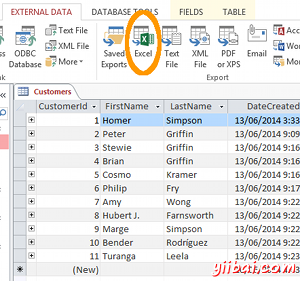
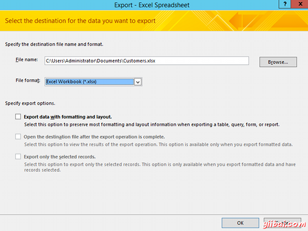

# Access数据库导出到excel - Access教程

大多数Access用户，在某些时候，需要他们的Access数据库导出到Excel电子表格。OK，大多数用户并不需要导出整个Access数据库 - 他们通常会只需要导出一个表或查询的结果到Excel。一旦在Excel中，他们可以使用这些数据，因为他们通常会在Excel中使用数据。

Excel不是数据导出的唯一格式。 你可能想从访问XML，HTML，CSV文件，甚至是PDF文件导出。 幸运的是，你可以在Access2013做这些。

## 导出到Excel

这里演示如何从MS Access到Excel导出数据。

1.  打开包含要导出的数据表或查询
2.  确保外部数据选项卡中选择功能区上，单击Excel下载图标(这是一个具有向下箭头)： 
3.  点击确定保存文件的默认位置。可替代地，改变的位置和/或文件名。您也可以选择要包括任何其他选项： 
4.  单击关闭。或者您可以点击关闭之前选择保存导出步骤。

现在你有一个包含从查询，您可以发送给任何喜欢的数据到Excel电子表格。

正如你可以从功能区看，你可以导出到其他文件类型，如XML，文本文件，甚至是PDF文件。步骤是与上述类似，可以试试。

