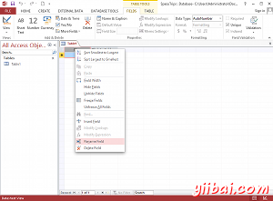

# 关于Microsoft Access - Access教程

Microsoft Access是一个关系数据库管理系统(RDBMS)，主要是为家庭或小型企业的使用而设计的。

Access 在传统上被称为一个桌面数据库系统，因为它的功能旨在一台计算机上运行 (而不是应用程序安装在服务器上的服务器数据库应用程序，然后远程从多个客户机访问).

话虽如此，Microsoft Access时包括网络解决方案（以及它的桌面解决方案）2010年以来，它集成了ShareYiibai和SQL Server 2013。本教程重点介绍的桌面解决方案。

Microsoft Access（或MS接入）安装，就像任何其他软件的软件包，并捆绑作为Microsoft Office套件的一部分。

## Access VS Excel

你可能想知道使用Access想比较使用Excel电子表格的好处。 嗯，这真的取决于你想要做的，以及存储多少数据，或要存储的数据是什么。

如果只存少量的数据，对每一块数据的没有太多属性，使用Excel可能会可以了。或如果没有关系型数据的途径而使用多个工作表。一旦对存储每一块数据有许多属性，当发现自己重复跨多个工作表信息，那么可以考虑开始使用Access（或其他数据库系统，如果你喜欢）。

使用Excel接入的另一个重要原因是，如果需要生成大量的查询和报表。 使用Access 比Excel更适合。

## Access 文件扩展名

当您在Microsoft Access中创建（保存）数据库，该数据库保存了一个.accdb扩展。这是开发中使用Access数据库时，需要用文件扩展名。旧的Access数据库使用扩展名为.mdb或有时使用.mde扩展，但这只是在2007年；微软开始逐步走出这些支持.accdb扩展。如果您无法打开旧数据库，可能需要先使用Access2013版本来转换.accdb。

## 下载Microsoft Access

如果你目前在计算机上没有安装Microsoft Access，可以下载 [MS Access 官方网站](http://office.microsoft.com/Access)

## Access 版本

本教程使用的是Microsoft Access2013。如果您使用的是不同的版本，屏幕截图可能看起来有点不同。一般来说，大多数的基本功能在Access版本之间是保持一致的，所以你应该能够遵循使用这些，这是没有任何问题的。

