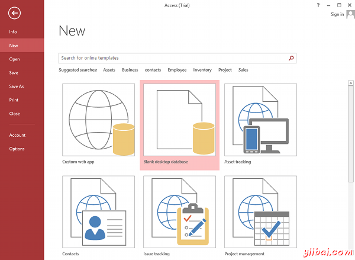
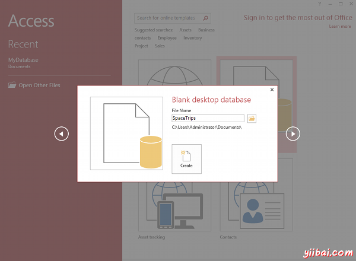
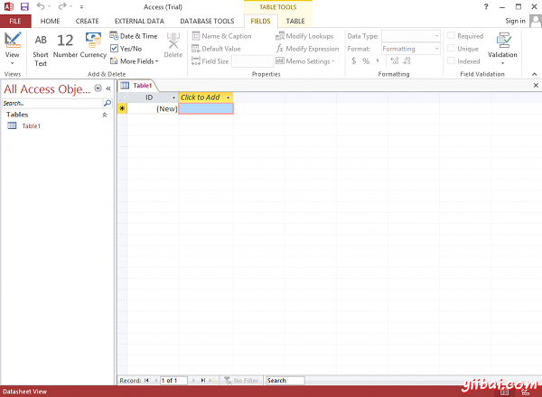

# Access创建数据库 - Access教程

在本教程中，我们将创建一个虚构名为“Space Trips”的数据库。这个公司销售的太空飞船！太空旅行的客户是那些喜欢让自己的行程非常冒险。他们喜欢“self-fly”假期，访问其他星球。 于是，他们要去太空旅行时需要购买新的太空飞船。

由于生意十分红火，该公司现在需要一个数据库来跟踪他们的客户，记录客户购买的产品。让我们使用Microsoft Access 2013来创建一个数据库以满足他们的需求。

## 创建一个数据库

第一步，建立一个数据库！我们将首先创建一个空数据库。那么在整个教程的其余部分，我们将做补充，使其适合我们最喜爱的太空旅游公司的需求。

在Microsoft Access创建数据库与创建Word文档一样简单！本课演示如何在MS Access创建数据库。

1.  您可能会注意到，当你第一次启动Microsoft Access2013，您将看到以下画面。在这种情况下，可以简单地选择空白桌面数据库（然后跳到第3步）。 

    如果已经打开Access，可以从到文件(file)菜单： 

2.  选择“空白桌面数据库”（Blank desktop database）. （跳过这一步，如果你已经选择了空白的桌面数据库在步骤1）。也可以选择其他，但在这里我们只使用一个空数据库： 
3.  选择一个名称，然后单击创建。让我们把它叫做"太空旅行"(SpaceTrips). 可以使用默认位置，或单击文件夹图标来改变位置： 

### 新数据库

一旦你完成上述步骤后，应该看到一个空数据库，就像这样：

我们知道，这个数据库是空白的，因为它只包含一个表（称为表1）和表只有一列（称为ID）。因此，我们需要更多的列添加到表并命名表的名称。下一步 [创建一个表](http://www.yiibai.com/access/create_a_table.html).

