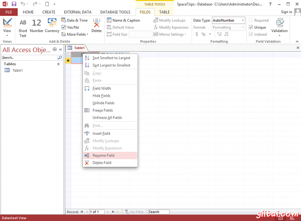
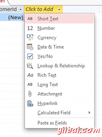
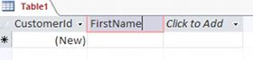
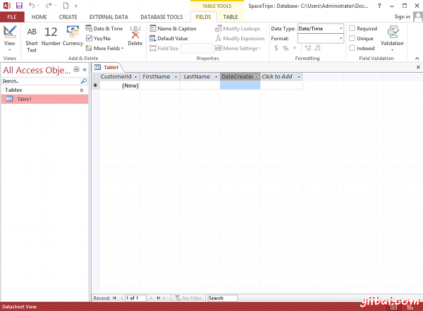
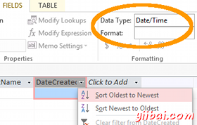

# Access创建表 - Access教程

有了数据库管理系统，在输入数据之前，您需要创建表。 Microsoft Access创建表非常容易。 事实上，当你创建一个数据库，Access创建你的第一个表(称为Table1)。

通常情况下，当你需要创建一个新的表，选择CREATE &gt; Table 从功能区工具栏。但我们可以稍后做这一步。

目前Access已经创建了第一个表，所以我们需要做的是让它适合需要修改的表。

使用我们之前的[空数据库](http://www.yiibai.com/access/create_a_database.html), 我们将重新命表名 Table1 为 Customers. 此表将有4列： CustomerId, FirstName, LastName, 和 DateCreated.

1.  重命名ID 字段为 CustomerId. 要做到这一点, 在ID列单击鼠标右键，选择重命名字段。 输入CustomerId 当它出现提示: 
2.  在接下来的字段中，单击单击添加（除非接入已经打开的菜单中），然后选择短文本： 
3.  此时，Access将方便凸显/选择字段名（目前Field1），这样就可以命名字段为FirstName： 
4.  再下一个字段（LastName），然后同样的选择数据类型为短文本（Short Text）。
5.  在接下来的字段中，为字段dateCreated选择日期和时间数据类型

我们刚刚创建的列名，并指定可以输入的数据类型。 限制每一列的数据类型是非常重要的，并帮助维护数据的完整性。它可以保证用户输入在预定格式的数据。它还可以防止意外，例如，无意中输入电子邮件地址到一个字段，用于存储当前日期。

数据库表不应该是这样的：

你现在可能注意到，当点击字段名，不能看到或更改它们的数据类型。相反，如果点击某个字段的倒三角形，你看到不同的菜单选项(例如，排序最旧到最新等) 根据该字段的数据类型。这表明字段已有数据 - 一旦有数据，就可以用这个菜单排序。

如果你不小心输入了错误的数据类型，那么不要担心。 可以通过调整下的数据类型下拉数据类型（右上方工具栏的区域）改变功能区工具栏的数据类型。如果你不能在工具栏中看到这个选项，一定要首先选择字段标签：

我们刚刚创建了一个数据库表。我们在数据表创建视图。下一步，我们来看看[设计视图](http://www.yiibai.com/access/design_view.html "设计视图")

