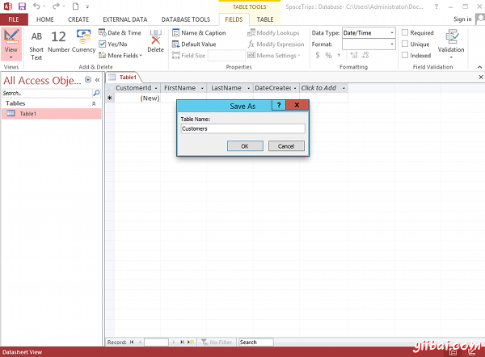
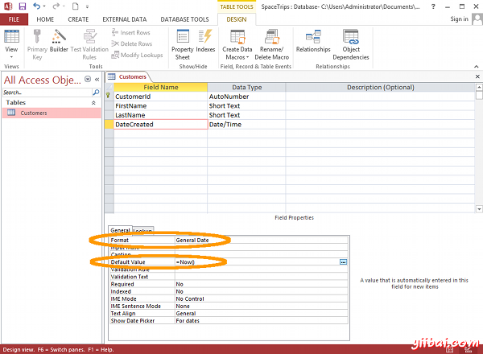
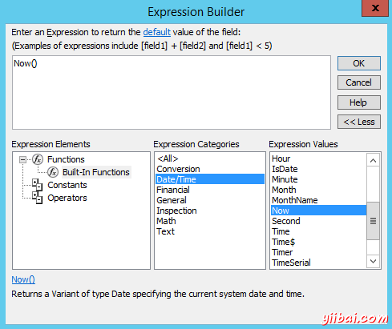
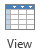

# Access设计视图 - Access教程

上一节中我们介绍如何[创建一个表](http://www.yiibai.com/access/create_a_table.html)，我们已在数据表视图。我们还可以查看该表在设计视图。

## 什么是设计视图?

设计视图使您能够设计并建立数据库(如“幕后” 查看数据库)。这是你的设置和配置的表，窗体，报表等。

当你继续使用MS Access工作，你会发现自己经常在设计视图和数据表视图之间切换(或者窗体，布局视图的情况下)。所以在初期这是很好的熟悉这个概念。

## 切换到设计视图

下面的步骤演示如何切换到设计视图。

1.  点击 View 图标的左上角（仅仅在文件菜单下）。VIew图标目前看起来是这样的： 
2.  此时，Access 会要求命名并保存刚才创建的表。键入Customersand，然后单击确定： 
3.  你现在看到在设计视图中Customers表。点击dateCreated字段，然后在底部窗格中，输入 =Now() 在默认值字段。同时单击格式字段，然后从上下文菜单中通用日期： 

我们刚为dateCreated字段设定缺省值。 这意味着，当一个新的记录被输入时，这个字段中将被自动填充当前的日期和时间，我们还指定了存储在该字段的所有日期的格式。

可以看到，我们已经配置只有两个在此窗格中的许多选项。 这些选项可以用来进一步说明到底是什么类型的数据可以被输入到数据库以及任何约束或默认值，设置对每个字段。一些选项包括限制数据的长度（以下字段大小），设置一个默认值（我们刚刚做了），指定是否为必填字段等等。

在实践中，可能会想收紧的一些规则 - 如指定一个字段是否为必填字段或没有（即不能留空）。但对于本教程的目的，我们不会强求。

还可以看到色带现在有一组新的设计相关的选项的设计标签。

## 主键

可能已经注意到了一点“key”图标，客户ID字段的左侧。这表示该字段是主键。主键确保了该列中的数据是唯一的 - 没有两个值可以是相同的。这是当您要执行查询或对表运行报告。[建立与其他表的关系](http://www.yiibai.com/access/create_a_relationship.html)这是非常重要的。

## 表达式生成器

您也可以点击小 ...按钮，只要在默认值字段（和其他字段也是如此）单击出现。 按钮，只要你在默认值字段（和其他字段也是如此）单击出现。点击该按钮打开表达式生成器，使您能够浏览一个合适的函数，常量或操作符，以帮助您构建了字段的表达式。

我们可能很容易地使用表达式生成器来建立 =Now() 表达式：

## 切换回数据表视图

现在，我们在设计视图，可能已经注意到，查看图标看起来不同 - 它已经从一个设计视图的图标变成了一个数据表视图图标。现在看起来是这样的：

点击视图图标返回到数据表视图，我们将看看选择将数据添加到我们的表格。

