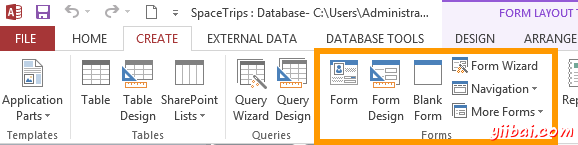
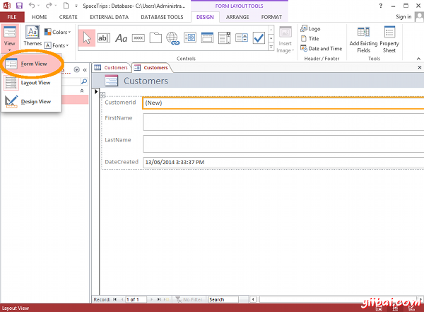
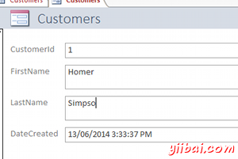
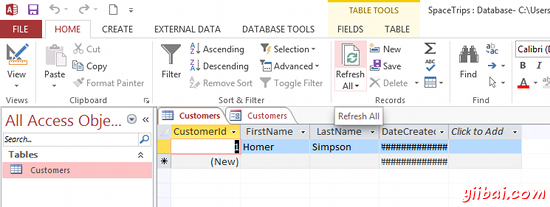
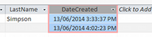
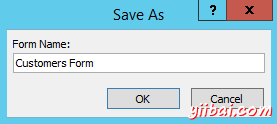

# Access创建表单 - Access教程

如前所述，Access表单提供非技术用户将数据添加到数据库中的能力。表单也可以更容易地将数据插入在多个表中。

有几种方法来创建一种表单(您可以通过下面的截图中看到)：

选项包括使用窗体向导，设计视图，甚至开始使用一个空白表单。 选择的选项将取决于您自己的选择以及要创建的表单也许是类型。导航(Navigation)选项是用于创建表单，其允许用户导航数据库对象，如其他表单。窗体向导(Form Wizard)选项步骤用来完成创建一个表单的过程。 如果使用表单向导中，你可以随时修改使用设计视图。

对于本教程的目的，我们将尽可能快地创建表单。 然后我们以后再回去修改它。下面是在Access中创建表单的快捷方式。

1.  确保Customers表中选择（在左侧导航窗格中），从功能区中，选择 CREATE FORM ! [MS Access 2013: Create a form - step 1](../img/21454HW8-1.png)
2.  访问刚刚创建的版式视图中一个全新形式的基础上，在Customers 表中的字段。点击下查看图标，然后选择倒三角的表单视图： 
3.  这是用户会看到表单。继续和数据输入FirstName和LastName字段。 一定要按下Enter键，已经进入了名字。然后打再次输入添加另一个记录。 
4.  现在，让我们来看看表。点击左侧导航Customers，当点击刷新所有的功能区。不应该看到新创建的记录表： 

你可能会注意到，dateCreated会现场充满了哈希符号######。 这是因为，该列是目前太窄以显示数据。 可以调整列的列标题的一侧以适应通过双击数据。首先，将光标移动到列标题的边缘，直到它改变的外观成为一个调整大小的工具，然后双击。列不应该足够宽，以显示数据：

现在，让我们切换回的表单和保存。

1.  点击称为第二个选项卡的客户（第一个是Customers表），然后点击左上角的保存图标（如上功能区）： 
2.  提示时重命名表单为 Customers Form： 

形式将会出现在下面的表单标题左侧导航栏。

