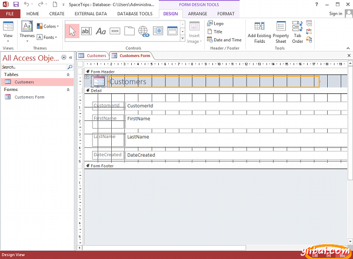
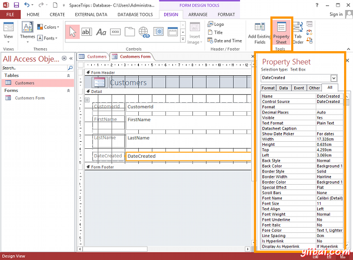
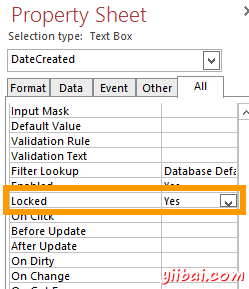
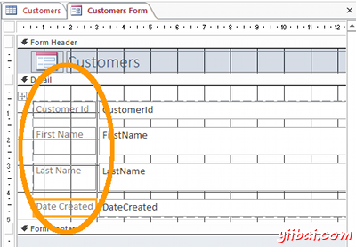
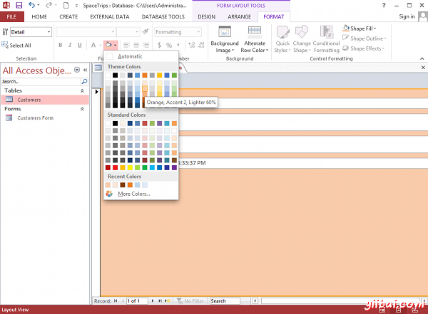
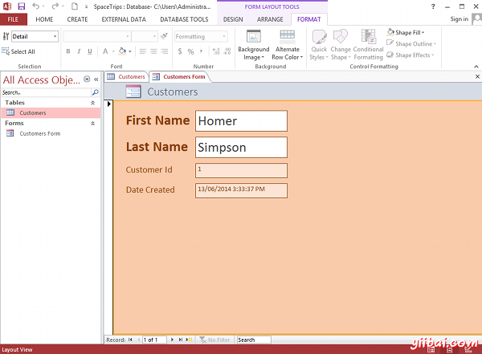
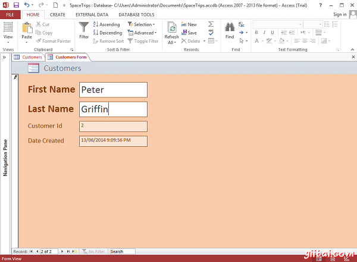

# Access修改表单 - Access教程

因此，我们刚刚创建表单。虽然表单如预期工作(即进入数据到数据库表)，这里会再加以改进。

在这里，我们会给表单一个全新的外观，我们还可以防止用户修改DateCreated字段。

虽然我们一直在使用功能区上的浏览图标来切换视图，还可以通过使用图标访问(下图)的右下角切换视图。

## 设计视图

1.  单击设计视图(Design view)图标访问的右下角 (还可以使用图标功能区的左上角，如果你喜欢): 
2.  点击dateCreated字段，然后单击属性表(Property Sheet)。属性表将显示在表格右侧：  
3.  在属性表，向下滚动，直到看到锁定选项。使用下拉控制改变其值设置为是(Yes)。  我们刚刚“锁定”dateCreated字段，使用户不能改变它。此字段用于存储每个记录被首先输入到系统中的日期。因此其值不会改变。通过锁定外地用户不能不慎（甚至是恶意）改变了它。我们仍然可以显示字段，对于用户的信息，我们不希望改变它。
4.  下一步，选择客户ID标签（标签是一个在左边 - 不要接触右侧），并添加一个空格，使之成为客户ID。 其他字段执行相同的操作。这只是使表单只有可读性，因为标签就像用户所看到的。它应该是这样的： 
5.  现在关闭属性表并切换到布局视图。

## 布局视图

现在是时候让我们形成一个新的布局外观。

1.  在布局视图，单击窗体的空白部分（也就是远离字段）。选择表单详细信息区域。
2.  从功能区中，选择一个背景颜色表单： 
3.  现在随意格式化的一些页面上的其他元素。例如，背景颜色上的每个字段，改变每个字段中的边框颜色，粗体的标签等 如果您想选择多个字段，按住Shift键的同时选择它们。甚至可以通过点击和拖动它们移动字段。还可以通过单击并拖动其边缘（你也可以通过属性表做）调整的字段。这里有一个表格作为例子： 

## 表单视图

现在切换回表单视图，并查看表单的外观和工作。在输入几个记录或更多。也可以滑动的导航窗格回腾出更多空间用于表单（可以在任意视图做到这一点）。

  