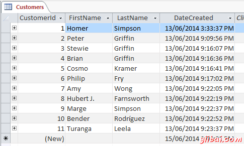
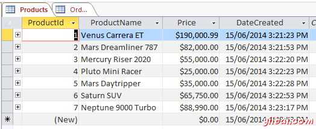
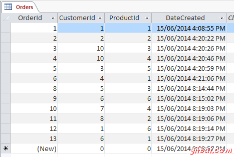
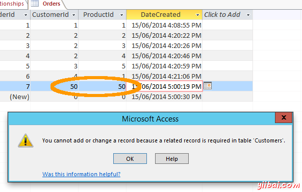
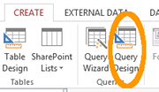
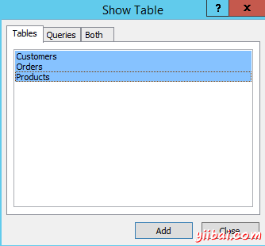
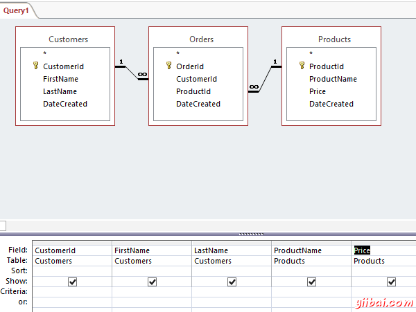
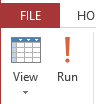
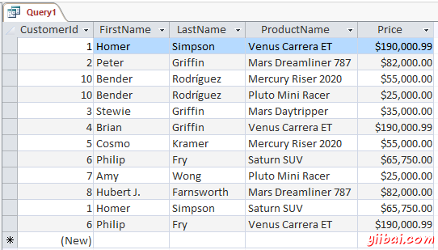
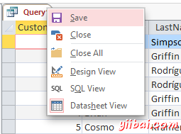

# Access创建查询 - Access教程

查询是指指示数据库返回的一些数据(或全部)在数据库的动作。 换句话说，在“查询”数据库中的一些数据匹配一个给定的标准。查询是针对一个或多个表运行仅返回感兴趣的数据。

例如，你可能会喜欢看所有个人的姓氏为“Griffin”的名单。 或者你可能希望看到所有数据库中在给定的时间内注册用户的列表。您可能还希望看到哪些客户已订购了特定产品。要做到这一切，你需要执行一个查询。

## 示例数据

在我们开始之前查询数据库，我们也许应该确保首先得到了足够的数据。 否则，不管你的查询有多好 - 如果没有数据，它们都将返回零的结果。因此，让我们加入一些数据。

_**记住**，ID列和dateCreated会列自动生成， 所以只需要输入数据到表中的另外两列。_

### Customers 表

你可以随意补加你自己的数据。这里是我的：

### Products 表

你可以随意补加你自己的数据。这里是我的：

### Orders 表

再次，随意弥补自己的，但是你需要确保在客户ID和产品ID字段中的值相匹配实际ID相应的表。例如，如果你的订单表包含ID为5的客户，那需要确保在**Customers**表中的实际要有一个客户的客户ID为5。下面是Orders表的一些样本数据：

## 引用完整性

当你创建一个关系，你还必须实施参照完整性（这是我们选择的时候，我们创建的关系）的选项。这可以防止其在引用表中没有相应的主键值外键值。

使用我们的表作为一个例子，假设你有10个记录在Customers表（客户ID为从1-10），但你的订单表包含使用客户ID为11的记录。在这种情况下，参照完整性没有被维持。如果你已经对关系实施参照完整性（因为我们有），访问将阻止这种情况的发生。

下面是如果你试图输入一个值，将违反参照完整性提示的一个截图。在这种情况下，我试图输入客户ID为50和ProductId为50，但客户和产品表没有客户ID为或产品编号为50的记录：

请注意，如果您已经启用实施参照完整性只能得到这个消息。如果您还没有实施参照完整性，Access会愉快地让你输入毫无意义的数据值，数据库的引用完整性就会没有起作用。

## 创建查询

现在，让我们创建一个返回已订购了产品的所有客户的名称的查询。

1.  确保你已经创建选项卡上的功能区打开，单击：Query Design 
2.  显示表对话框将会出现使用所有列出的表中。选择所有三个表，然后单击添加，然后单击：**Close**: 
3.  三个表没有在顶部窗格中所示（功能区下方）。选择在您的查询的结果将提交的字段。可以双击字段名称或单击并拖动它到一个列在底部窗格中。选择字段，如下所示： 
4.  请单击功能区的左上角部分的运行（**run**）按钮： 
5.  你不应该看到这样的查询结果。因为这里是我的： 
6.  保存方法是右键单击该查询Query1选项卡上，并给它起名字为：Customer Orders: 

## 那么我们的查询实际上是怎么做的？

我们查询成功返回至少一个产品的所有客户订单，它包括产品，其价格在名字的旁边。也可以看到，一些客户已经订购了多个产品。该查询使用，我们创建并返回匹配的数据自动加入了三张表之间的关系。

这个查询只能返回至少有一个产品的客户订单。如果客户在客户表中，但不订购产品，客户的记录不会显示在此查询的结果。如果你回头看看Customers表（接近这个页面的顶部），你会看到，玛吉·辛普森（Marge Simpson）是一个客户但她没有订购的产品，但（即她没有在订单表的相应的记录）。 好吧，事实上，Marge 只是一个潜在的客户。她只是表示在购买太空船的兴趣。但是，这并没有将她的名字加入到数据库！

在任何情况下，查询已完成其工作。我们不希望看到，没有订购任何东西的客户的名单中。

