# DB2服务器安装 - DB2教程

本章介绍DB2服务器安装步骤。

## 介绍

可以下载DB2服务器试用版或购买产品许可证在www.ibm.com。有可供下载，这取决于操作系统的大小，在其上它被用于执行两个单独的DB2服务器。例如，如果要下载一个DB2服务器的32位Linux或UNIX操作系统，那么需要下载一个32位DB2服务器。这同样适用于64位DB2服务器。

## 硬件要求

处理器：最低2Duo核

内存 : 1GB 最少

硬盘 : 30GB 最少

## 软件要求

要安装DB2服务器，系统需要准备DB2所需的软件。对于Linux，需要安装“libstdc++6.0”。

## 检查系统兼容性

安装DB2服务器，需要验证系统是否能与DB2服务器兼容。对于确认的兼容性，需要在控制台调用 “db2prereqcheck” 命令。

## 在Linux操作系统上安装DB2

打开终端，并使用“CD&lt;DB2安装文件夹&gt;”命令设置在控制台上的DB2安装映像文件夹路径。然后输入“./db2prereqcheck”命令，验证系统和DB2服务器的兼容性。

```
./db2prereqcheck

```

图1显示了Linux操作系统和硬件系统的兼容性要求。

按照Linux系统上提供的安装DB2的步骤：

*   打开终端
*   使用root用户登录
*   打开DB2的安装文件夹
*   输入“./db2setup” 并回车

这一过程将开始执行DB2服务器设置。

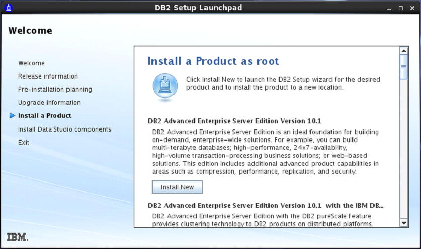

输入“./db2setup”，然后按Enter根终端上启动DB2服务器的安装过程。

就这样，“Set up Launch Pad”画面如下 [图2]

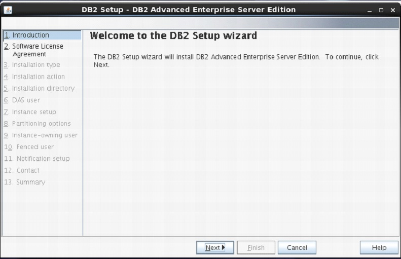

在安装启动盘页面，选择“Install a Product”，从左侧菜单中的选项。选择选项“DB2 Advanced Enterprise Server Edition”。选择“Install New”按钮。

出现一个新的帧名为“DB2 setup wizard”。点击“Next”。 〔图3〕

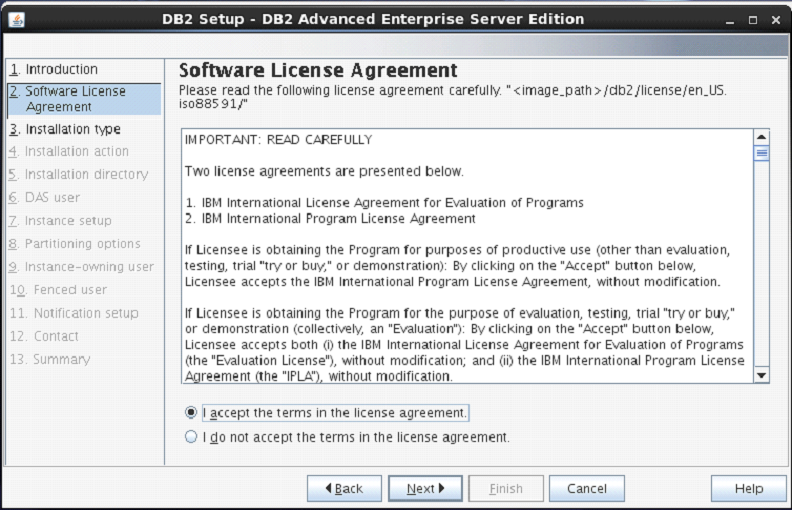

下一个屏幕出现在DB2许可协议。选择“I accept the terms…”，点击“Next”。 [图-4]

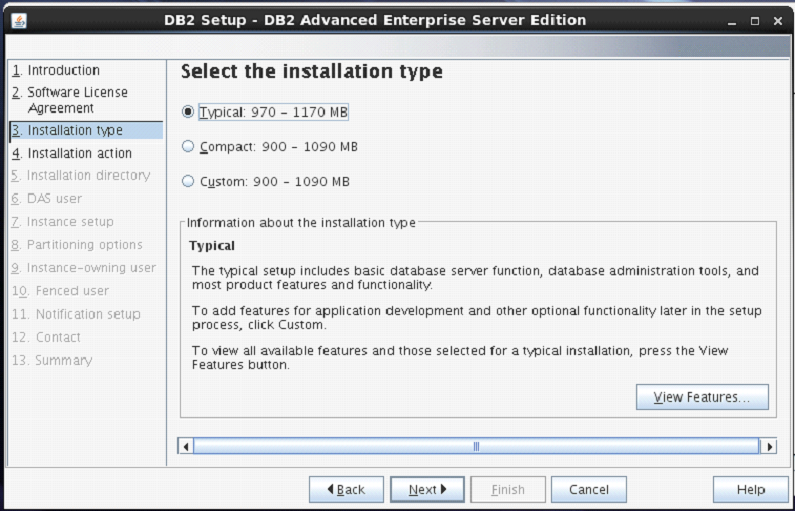

接着屏幕出现了提供的安装类型，默认情况下设置为“Typical”。

保持相同的选择。点击“Next”。 [图-5]

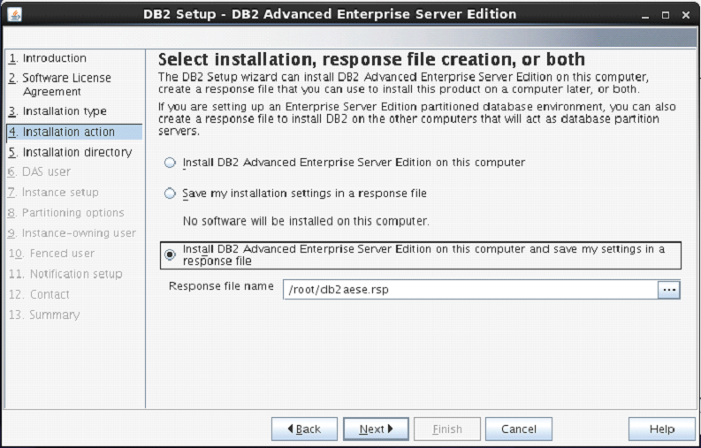

下一个屏幕出现安装操作。

选择 “Install DB2 Advanced Enterprise Server Edition…”

点击“Next”. [Figure-6]

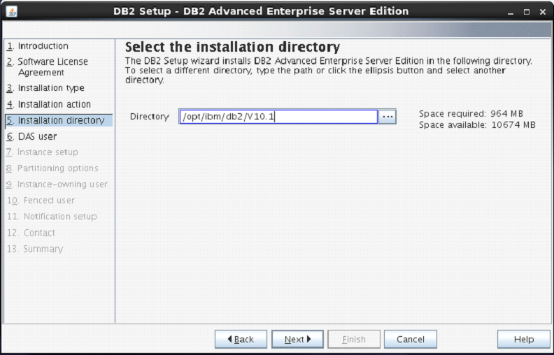

在下一屏，安装程序会要求选择安装目录。

保持默认，单击 “Next”.

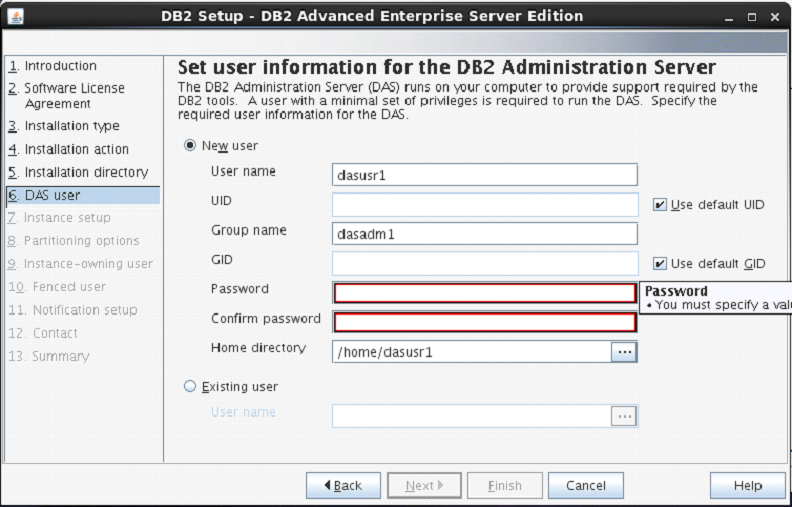

下一个屏幕是用户认证。请输入“dasusr1”用户的密码。

（密码可以与用户名相同，这样可以很方便地记住）

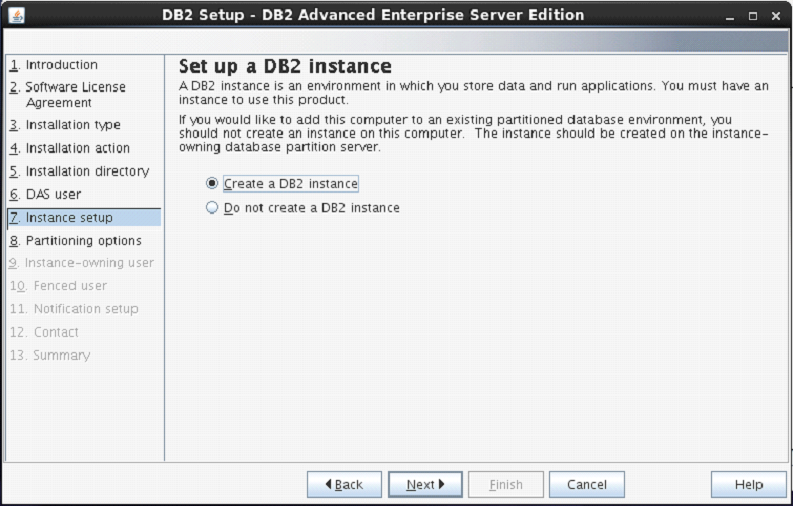

在下面的屏幕中，安装程序询问创建DB2服务器实例。

在这里，它正在创造名称为“db2inst1”的DB2实例。

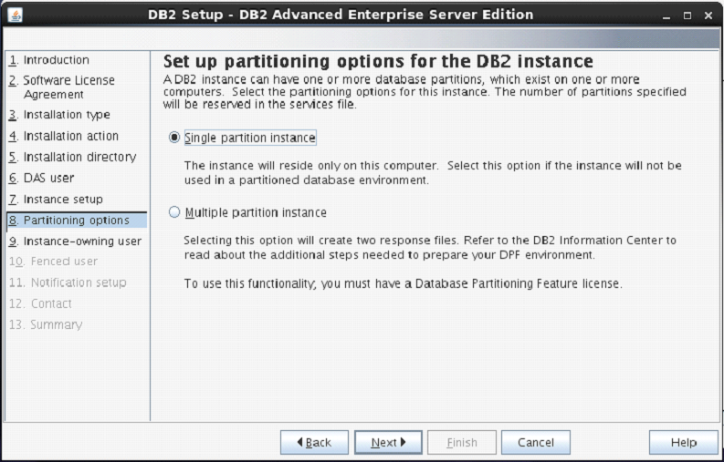

下一个屏幕会询问是否需要为默认实例分区的数量。

这里有“single or Multiple”分区的选择。

选择“single partition instance”，点击“next”。

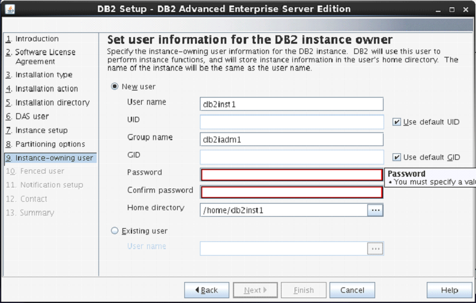

在下一屏幕上，设置要求提供身份验证以使用正在创建DB2实例。

在这里，通过默认的用户名创建为“db2inst1”。可以输入与用户名相同的密码。

点击 “Next”.

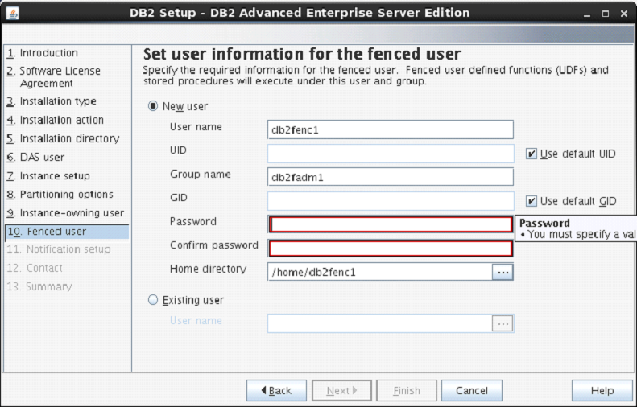

在下一屏幕上，设置要求输入认证信息为“db2fenc”用户。

在这里，可以输入与用户名相同的密码。

点击 “Next”.

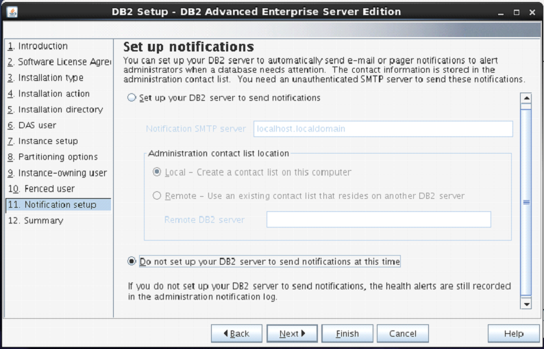

在下一屏幕上，可以选择“Do not setup your db2 server to send notifications at this time”选项。

点击 ”Next”.

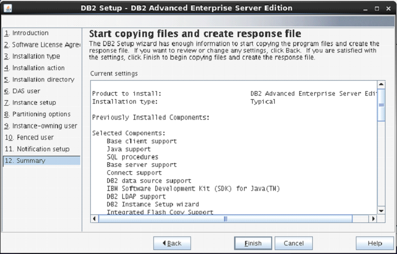

下一个屏幕显示有关DB2安装信息。

点击 “Finish”.

这个阶段DB2安装程序完成。

## 验证DB2安装

需要验证DB2服务器的安装。在完成DB2服务器的安装，从当前的用户模式注销并登录到“db2inst1”用户。在“db2inst1”用户环境，可以打开终端，执行以下命令来验证DB2产品正确或未安装。

### db2level

该命令显示已安装的DB2产品的当前实例的当前版本和服务级别。

语法:

```
db2level 

```

例子:

```
db2level 

```

输出:

```
DB21085I Instance "db2inst2" uses "64" bits       
And DB2 code release "SQL10010" with level     
identifier "0201010E". Informational tokens     
are "DB2 v10.1.0.0", "s120403",     
"LINUXAMD64101", and Fix Pack "0".  
Product is installed at "/home/db2inst2/sqllib".  

```

### db2licm

该命令显示了DB2产品的所有许可证的相关信息。

语法:

```
db2licm <parameter> 

```

示例:

```
db2licm -l 

```

输出:

```
Product name:                     "DB2 Advanced Enterprise Server Edition" 
License type:                     "Trial" 
Expiry date:                      "10/02/2014" 
Product identifier:               "db2aese" 
Version information:              "10.1"  
Product name:                     "DB2 Connect Server" 
License type:                     "Trial" 
Expiry date:                      "10/02/2014" 
Product identifier:               "db2consv" 
Version information:              "10.1" 

```

## 命令行处理器（CLP）

CLP 可以在三种模式中的一种使用：

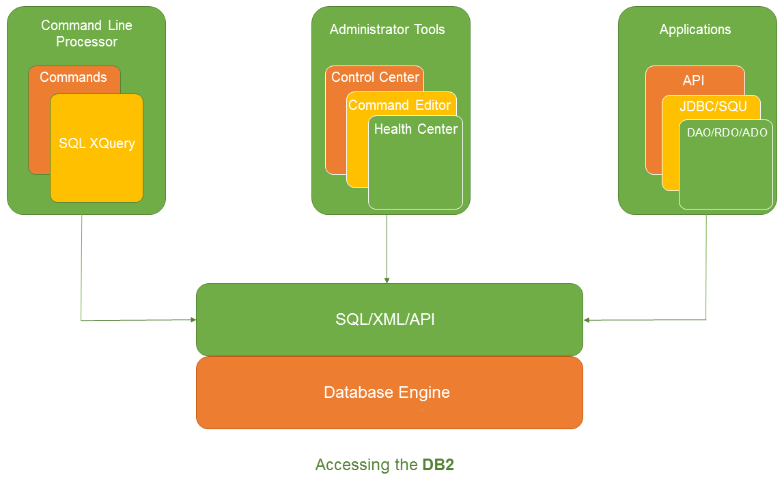

1.  **命令模式：**在这种模式下，每个命令和SQL语句必须通过“DB2”作为前缀。例如，查询“DB2数据库激活样本”。
2.  **交互式输入方式：**可以通过使用“DB2”命令来启动该模式。在这里可以通过SQL语句而不使用前缀。例如，“激活数据库样本”。
3.  **批处理模式：**在这里，需要创建一个脚本文件，其中包含了要求的所有SQL查询并保存“名为.db2”扩展名的文件。可以使用语法“DB2-tf&lt;filename.db2&gt;”，在命令行调用此文件。

