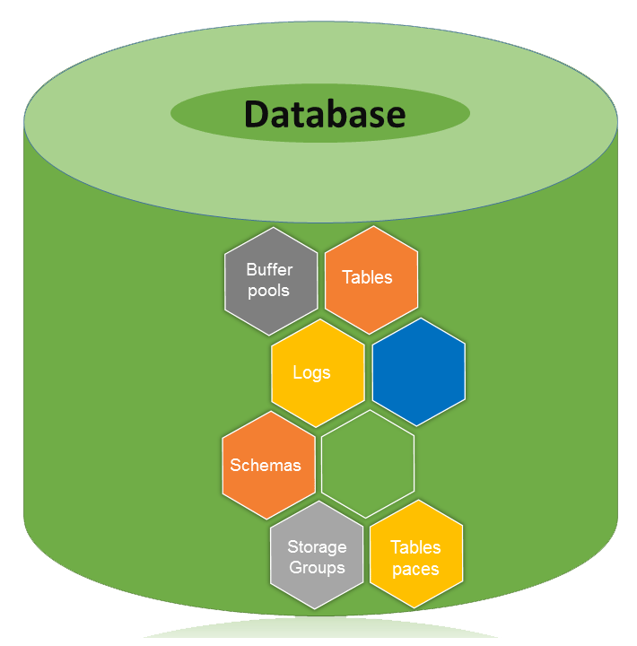

# DB2数据库 - DB2教程

本章介绍DB2的创建，激活和停用数据库的相关语法。

## 数据库体系结构



数据库是表，模式，缓冲池，日志，存储组和表空间合作有效地处理数据库操作的集合。

## 数据库目录

数据库目录有组织的存储数据库。当创建一个数据库，所有有关数据库的详细信息存储在一个数据库目录，如默认存储设备，配置文件和临时表清单等详细信息

分区全局目录是在实例文件夹中创建。该目录包含关于数据库中的所有全局信息。这个分区全局目录被命名为NODExxxx/ SQLyyy，其中xxxx是数据分区号，yyy是数据库令牌。

在分区全局目录，成员特定的目录创建。该目录包含本地数据库的信息。会员专用目录被命名为MEMBERxxxx其中xxxx是一个成员号。 DB2企业服务器版环境中运行在单一的成员，只有一个成员的具体目录。这个成员的特定目录唯一命名为MEMBER0000。

## 分区全局目录

目录位置：&lt;instance&gt;/NODExxx/SQLxxx

分区全局目录包含下面列出的数据库相关的文件。

*   全局死锁写入到文件的事件监控文件
*   表空间信息文件 [SQLSPCS.1, SQLSPCS.2]
*   存储组控制文件 [SQLSGF.1, SQLSGF.2]
*   临时表空间容器文件 [/storage path/&lt;database&gt;/T0000011/C000000.TMP/SQL00002.MEMBER0001.TDA]&lt;/database&gt;
*   全局配置文件 [SQLDBCONF]
*   历史文件 [DB2RHIST.ASC, DB2RHIST.BAK, DB2TSCHG.HIS, DB2TSCHG.HIS]
*   日志记录相关的文件 [SQLOGCTL.GLFH.1, SQLOGCTL.GLFH.2]
*   锁定文件 [SQLINSLK, SQLTMPLK]
*   自动存储容器

## 成员指定的目录

目录位置: /NODExxxx/SQLxxxx/MEMBER0000

该目录包含：

*   数据库相关联的对象
*   缓冲池信息文件 [SQLBP.1, SQLBP.2]
*   本地事件监测文件
*   日志记录相关的文件 [SQLOGCTL.LFH.1, SQLOGCTL.LFH.2, SQLOGMIR.LFH].
*   本地配置文件
*   死锁事件监视器文件。详细的死锁事件监视器文件存储在目录节点的数据库目录中的情况下，ESE和分区数据库环境。

## 创建数据库

可以创建实例的数据库使用“CREATE DATABASE”命令。所有数据库都使用默认的存储组“IBMSTOGROUP”，这是在创建实例时创建创建。在DB2中，所有的数据库表都存储在“tablespace”，它利用各自的存储组。

该权限的数据库被自动设置为PUBLIC[CREATETAB，BINDADD，CONNECT，IMPLICIT_SCHEMA，并选择]，但是，如果RESTRICTIVE选项，将不授予权限为PUBLIC。

## 创建非限制性的数据库。

该命令用来创建一个非限制性的数据库。

语法：[要创建一个新的数据库。 “database_name”表示一个新的数据库名称，要创建]

```
db2 create database <database name>
```

例如：要创建名为“one”新的非限制性数据库]

```
db2 create database one
```

输出：

```
DB20000I The CREATE DATABASE command completed successfully.
```

## 创建数据库的限制

严格数据库的调用此命令创建的。

语法: [在下面的语法中，“db_name”表示数据库的名称。]

```
db2 create database <db_name> restrictive 
```

例如：要创建一个名为“two”的新限制数据库]

```
db2 create database two restrictive 
```

## 用不同的用户定义的位置创建数据库

创建一个默认的存储组“IBMSTOGROUP”在不同路径的数据库。此前，调用命令“create database”没有存储或在特定位置创建数据库，或用户定义的任何位置。要使用用户定义的数据库位置创建数据库，如以下步骤：

语法: [在下面的语法中，“db_name'表示'数据库名称'和'data_location”表示，其中有将数据存储在文件夹和“db_path_location'表示'data_location”的驱动程序位置。]

```
db2 create database '<db_name>' on '<data location>' dbpath on '<db_path_location>'  
```

示例: [创建名为“four”，其中数据被存储在“data1”数据库和该文件夹'dbpath1'中存储]

```
db2 create database four on '/data1' dbpath on '/dbpath1'
```

## 查看本地或系统数据库目录中的文件

执行这个命令来查看当前实例可用的目录列表。

语法:

```
db2 list database directory 
```

示例 :

```
db2 list database directory 
```

输出：

```
 System Database Directory  
 Number of entries in the directory = 6  
 Database 1 entry:  
 Database alias                       = FOUR  
 Database name                        = FOUR  
 Local database directory             = 
 /home/db2inst4/Desktop/dbpath  
 Database release level               = f.00  
 Comment                              =  
 Directory entry type                 = Indirect  
 Catalog database partition number    = 0  
 Alternate server hostname            =  
 Alternate server port number         =  
Database 2 entry: 
Database alias                       = SIX  
Database name                        = SIX  
Local database directory             = /home/db2inst4  
Database release level               = f.00  
Comment                              =  
Directory entry type                 = Indirect  
Catalog database partition number    = 0  
Alternate server hostname            =  
Alternate server port number         = 
```

## 激活数据库

该命令启动了所有必要的服务，为特定的数据库，这样的数据库是可用的应用程序。

语法:[‘db_name’ 指示数据库名称]

```
db2 activate db <db_name> 
```

**示例:** [激活数据库 ‘one’]

```
db2 activate db one  
```

## 停用数据库

使用此命令，可以停止数据库服务。

**语法:** 
```
db2 deactivate db <db_name>
```

**示例:** [要停用数据库 ‘one’]

```
db2 deactivate db one
```

## 连接到数据库

创建一个数据库，把它投入使用后，需要连接或启动数据库。

语法:

```
db2 connect to <database name> 
```

**示例:** [连接数据库到当前的一个 CLI]

```
db2 connect to one 
```

输出

```
 Database Connection Information  
 Database server        = DB2/LINUXX8664 10.1.0  
 SQL authorization ID   = DB2INST4  
 Local database alias   = ONE  
```

## 验证如果数据库处于限制

要检查这个数据库是限制与否，这里是使用的语法：

语法: [在下面的语法中，“db”表示数据库，“cfg”表示的配置，'db_name'表示数据库名称]

```
db2 get db cfg for <db_name> | grep -i restrict 
```

例如：要检查'one'数据库是否处于限制]

```
db2 get db cfg for one | grep -i restrict  
```

输出：

```
Restrict access                       = NO   
```

## 配置数据库管理器和数据库

实例配置（数据库管理器配置）被存储于命名为'db2system'文件和数据库相关的配置被存储于命名为'SQLDBCON'文件。这些文件不能直接编辑。可以使用该API调用的工具编辑这些文件。使用命令行处理器，可以使用这些命令。

### 数据库管理器配置参数

**语法：**[获得实例数据库管理器的信息]

```
db2 get database manager configuration   
```

或者

```
db2 get dbm cfg   
```

语法：[更新实例数据库管理器]

```
db2 update database manager configuration   
```

或者

```
db2 update dbm cfg  
```

语法：[重置以前的配置]

```
db2 reset database manager configuration  
```

或者

```
db2 reset dbm cfg  
```

### 数据库配置参数

**语法：**[来获得数据库的信息]

```
db2 get database configuration   
```

或者

```
db2 get db cfg  
```

语法：[要更新数据库配置]

```
db2 update database configuration    
```

或者

```
db2 update db cfg  
```

语法：[重置数据库配置以前配置的值]

```
db2 reset database configuration     
```

或者

```
db2 reset db cfg   
```

语法：[要检查当前的活动数据库的大小]

```
db2 "call get_dbsize_info(?,?,?,-1)"      
```

例如：[要验证当前激活数据库的大小]

```
db2 "call get_dbsize_info(?,?,?,-1)"      
```

输出：

```
Value of output parameters   
--------------------------   
Parameter Name  : SNAPSHOTTIMESTAMP   
Parameter Value : 2014-07-02-10.27.15.556775  
Parameter Name  : DATABASESIZE   
Parameter Value : 105795584  
Parameter Name  : DATABASECAPACITY   
Parameter Value : 396784705536  
Return Status = 0    
```

## 估计所需的空间数据库

以估计数据库的大小，下列因素的贡献必须考虑：

*   系统目录表
*   用户表数据
*   长字段数据
*   大对象（LOB）数据
*   索引空间
*   临时工作空间
*   XML数据
*   日志文件空间
*   本地数据库目录
*   系统文件

## 检查数据库权限

可以使用下面的语法检查的数据库认证对非限制数据库授予PUBLIC。

**第一步：**验证用户名和实例的密码连接到数据库。

语法：[连接到数据库的用户名和密码]

```
db2 connect to <db_name> user <userid> using <password>      
```

例如：为了连接“one”数据库，用户ID'db2inst4'和密码'db2inst4']

```
db2 connect to one user db2inst4 using db2inst4       
```

输出：

```
 Database Connection Information  
 Database server        = DB2/LINUXX8664 10.1.0  
 SQL authorization ID   = DB2INST4  
 Local database alias   = ONE        
```

**第二步：**验证数据库的权限。

语法：[下面的语法显示认证服务，为当前数据库的结果]

```
db2 "select substr(authority,1,25) as authority, d_user, d_group, 
d_public, role_user, role_group, role_public,d_role from table( 
sysproc.auth_list_authorities_for_authid ('public','g'))as t 
order by authority"      
```

例如：

```
db2 "select substr(authority,1,25) as authority, d_user, d_group, 
d_public, role_user, role_group, role_public,d_role from table( 
sysproc.auth_list_authorities_for_authid ('PUBLIC','G'))as t 
order by authority"       
```

输出：

```
AUTHORITY                 D_USER D_GROUP D_PUBLIC ROLE_USER ROLE_GROUP ROLE_PUBLIC D_ROLE  
------------------------- ------ ------- -------- --------- ---------- ----------- ------  
ACCESSCTRL                *      *       N        *         *          N           *       
BINDADD                   *      *       Y        *         *          N           *       
CONNECT                   *      *       Y        *         *          N           *       
CREATETAB                 *      *       Y        *         *          N           *       
CREATE_EXTERNAL_ROUTINE   *      *       N        *         *          N           *       
CREATE_NOT_FENCED_ROUTINE *      *       N        *         *          N           *       
CREATE_SECURE_OBJECT      *      *       N        *         *          N           *       
DATAACCESS                *      *       N        *         *          N           *       
DBADM                     *      *       N        *         *          N           *       
EXPLAIN                   *      *       N        *         *          N           *       
IMPLICIT_SCHEMA           *      *       Y        *         *          N           *       
LOAD                      *      *       N        *         *          N           *       
QUIESCE_CONNECT           *      *       N        *         *          N           *       
SECADM                    *      *       N        *         *          N           *       
SQLADM                    *      *       N        *         *          N           *       
SYSADM                    *      *       *        *         *          *           *       
SYSCTRL                   *      *       *        *         *          *           *       
SYSMAINT                  *      *       *        *         *          *           *       
SYSMON                    *      *       *        *         *          *           *       
WLMADM                    *      *       N        *         *          N           *         
20 record(s) selected. 
```

## 删除数据库

使用 drop 命令，可以删除我们从实例数据库目录数据库。这个命令可以删除所有对象，表，空间，集装箱和相关文件。

语法：[若要从实例中删除任何数据库]

```
db2 drop database <db_name>
```

**例子：**[从实例中删除'six'的数据库]

```
db2  drop database six 
```

输出：

```
DB20000I The DROP DATABASE command completed successfully 
```

