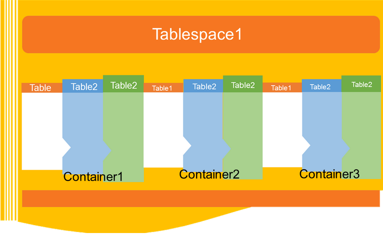

# DB2表空间 - DB2教程

本章将详细介绍表空间

## 介绍

表空间是一种存储结构，它包含表，索引，大对象和长数据。它可以被用于组织数据库中的数据为逻辑存储组，这是与其中存储的系统上的数据相关。表空间存储在数据库分区组。

## 数据库表空间的优点

表空间在数据库中的好处如下各种方式给出：

**可恢复性：**表空间做备份和恢复操作更加方便。使用一个命令，就可以使备份或还原所有数据库对象的表空间。

**自动存储管理：**数据库管理器创建和扩展根据需要容器。

**内存利用率：**一个缓冲池可以管理多个表空间。可以指定临时表空间，自己的缓冲池，以增加活动的表现，如排序或联接。

## 容器

表空间包含一个或多个容器。容器可以是目录名，设备名或文件名。在数据库中，一个单一的表可以有几个容器相同的物理存储设备上。如果表空间用自动存储表选项创建，容器的创建和管理是由数据库管理器自动处理。如果它不具有自动存储表选项创建，需要自己定义和管理的容器。

## 默认表空间

当创建一个新的数据库，数据库管理器会创建一些默认表空间数据库。这些表被用作存储为用户和临时数据。这里给出每个数据库必须至少包含三个表：

1.  目录表空间
2.  用户表
3.  临时表空间

**目录表空间：**它包含系统目录表的数据库。它被命名为SYSCATSPACE并且它不能被丢弃。

**用户表空间：**此表中包含用户定义的表。在数据库中，我们有一个默认的用户表，命名为USERSPACE1。如果创建的时候不为表指定用户定义的表空间，那么数据库管理器选择默认的用户表空间为您服务。

**临时表空间：**临时表空间包含临时表中的数据。该表空间包含系统临时表空间或用户临时表空间。

系统临时表空间持有在执行操作的数据库管理器所需的临时数据，如排序或联接。一个数据库必须至少有一个系统临时表空间，它被命名为TEMPSPACE1。这是在创建该数据库的时间创建。用户临时表空间拥有表的临时数据。它与DECLARE GLOBAL TEMPORARY TABLE创建或CREATE GLOBAL TEMPORARY TABLE语句。该临时表空间不是默认在创建数据库时创建的。

**表空间和存储管理：** 
表空间可以设置不同的方式，这取决于如何使用它们。可以设置操作系统来管理表空间的分配，可以让数据库管理员分配的空间，或者可以选择表空间自动分配数据。

有以下三种类型的管理空间可供选择：

**系统管理的空间(SMS)：**操作系统的文件系统管理器分配和管理，其中该表被存储的空间。存储空间分配上的需求。模型由代表数据库对象的文件。这种类型的表空间已过时的版本10.1用户定义的表空间，它不会被弃用的目录和临时表空间。

**数据库管理空间（DMS）：**数据库服务器控制的存储空间。存储空间是预分配在创建DMS表空间时指定基于容器定义在文件系统上。它是从10.1版本补丁包1弃用用户定义的表空间，但它不会被弃用的系统表空间和临时表空间。

**自动存储表空间:** 数据库服务器可自动管理。数据库服务器创建并扩展容器依赖于数据库中的数据。具有自动存储管理，它不是必需的，以提供容器的定义。创建和延伸容器利用分配给该数据库的存储后的数据库服务器查找。如果添加的存储空间来存储组，当现有容器达到其最大容量的新容器自动创建。如果想立即使用新增的存储，可以重新平衡的表空间。

**页，表和表空间大小：**

临时DMS和自动存储表空间，可以选择数据库页面大小决定了最大限制的表空间大小。对于表SMS和临时自动存储表空间，页大小约束表本身的大小。页面大小可以为4KB，8KB，16KB或32KB。

| 表空间类型 | 4K 面大小限制 | 8K  面大小限制 | 16K  面大小限制 | 32K  面大小限制 |
| --- | --- | --- | --- | --- |
| DMS，非临时自动存储器表空间常规 | 64G | 128G | 256G | 512G |
| DMS，临时DMS和非临时自动存储器表空间大型 | 1892G | 16384G | 32768G | 65536G   |

