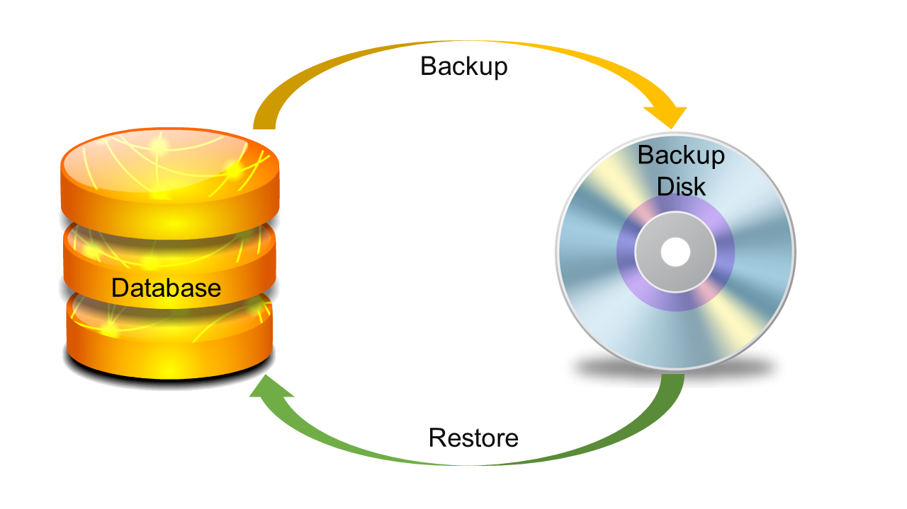

# DB2备份和恢复 - DB2教程

本章介绍DB2数据库备份和恢复数据库的方法。



备份和恢复方法的目的是让我们的信息安全。在命令行界面(CLI)或图形用户界面(GUI)使用的备份和恢复工具，可以备份或恢复在DB2 UDB数据库中的数据。

## 日志

日志文件包含错误日志，这是用来从应用程序错误中恢复的。日志保留更改数据库的记录。有如下所述两种类型的日志记录：

### 循环日志记录

它是一种方法，其中旧的事务日志被覆盖时，有必要分配一个新的事务日志文件，从而清除日志文件的序列和重复使用它们。允许需要全备份在离线模式。也就是说，数据库必须脱机采取完全备份。

### 归档日志记录

该模式支持在线备份，并使用被称为前滚恢复日志文件数据库恢复。备份模式可以从循环改为通过设置LOGRETAIN或USEREXIT为ON存档。对于归档日志记录，备份设置数据库需要的目录是可写的DB2进程。

## 备份

使用Backup命令，可以把整个数据库备份副本。该备份副本包括数据库系统文件，数据文件，日志文件，控制信息等。

可以备份脱机工作时或在线。

### 脱机备份

语法：[列出活动的应用/数据库]

```
db2 list application  
```

输出：

```
Auth Id  Application    Appl.      Application Id                                                
DB       # of   
         Name           Handle              
Name    Agents  
-------- -------------- ---------- ---------------------
----------------------------------------- -------- -----  
DB2INST1 db2bp          39         
*LOCAL.db2inst1.140722043938                                   
ONE      1  
```

语法：[使用的应用程序强制应用程序。处理ID]

```
db2 "force application (39)"   
```

输出

```
DB20000I  The FORCE APPLICATION command completed 
successfully.  

DB21024I  This command is asynchronous and may not 
be effective immediately. 
```

语法：[终止数据库连接]

```
db2 terminate  
```

语法：[关闭数据库]

```
db2 deactivate database one   
```

**语法：**[执行备份文件]

```
db2 backup database <db_name> to <location>   
```

**示例：** 
```
db2 backup database one to /home/db2inst1/ 
```

**输出**

```
Backup successful. The timestamp for this backup image is : 
20140722105345  
```

### 在线备份

首先，需要从循环日志改变到归档日志模式。

**语法：**[检查数据库使用循环或归档日志]

```
db2 get db cfg for one | grep LOGARCH   
```

输出

```
First log archive method (LOGARCHMETH1) = OFF  
 Archive compression for logarchmeth1  (LOGARCHCOMPR1) = OFF 
 Options for logarchmeth1              (LOGARCHOPT1) =   
 Second log archive method             (LOGARCHMETH2) = OFF  
 Archive compression for logarchmeth2  (LOGARCHCOMPR2) = OFF  
 Options for logarchmeth2              (LOGARCHOPT2) =   
```

另外，在上述输出，突出显示的值处于关闭模式[LOGARCHMETH1和LOGARCHMETH2]，这意味着当前数据库中的“CIRCULLARLOGGING”模式。如果需要用'归档日志记录“模式下工作，需要更改或添加路径变量LOGARCHMETH1和LOGARCHMETH2出现在配置文件中。

## 更新LOGARCHMETH1所需存档目录

**语法：**[创建目录]

```
mkdir backup 
mkdir backup/ArchiveDest    
```

**语法：**[提供文件夹的用户权限]

```
chown db2inst1:db2iadm1 backup/ArchiveDest 
```

**语法：**[更新配置LOGARCHMETH1]

```
db2 update database configuration for one using LOGARCHMETH1 
'DISK:/home/db2inst1/backup/ArchiveDest'
```

可以采取离线备份的安全性，激活数据库，并连接到它。

语法：[执行在线备份]

```
db2 backup database one online to 
/home/db2inst1/onlinebackup/ compress include logs   
```

**输出**

```
db2 backup database one online to 
/home/db2inst1/onlinebackup/ compress include logs    
```

使用下面的命令验证备份文件：

**语法：**

```
db2ckbkp <location/backup file>   
```

示例：

```
db2ckbkp 
/home/db2inst1/ONE.0.db2inst1.DBPART000.20140722112743.001 
```

清单备份文件的历史记录

**语法：**

```
db2 list history backup all for one    
```

**输出**

```
                    List History File for one 

Number of matching file entries = 4 

Op Obj Timestamp+Sequence Type Dev Earliest Log Current Log  
Backup ID  
 -- --- ------------------ ---- --- ------------ ------------ 
 --------------
  B  D  20140722105345001   F    D  S0000000.LOG S0000000.LOG 

 ------------------------------------------------------------ 
 ----------------   

 Contains 4 tablespace(s): 
 00001 SYSCATSPACE  

 00002 USERSPACE1

 00003 SYSTOOLSPACE 

 00004 TS1 
  ------------------------------------------------------------ 
  ---------------- 
  Comment: DB2 BACKUP ONE OFFLINE  

 Start Time: 20140722105345  

   End Time: 20140722105347

     Status: A
 ------------------------------------------------------------ 
 ---------------- 
 EID: 3 Location: /home/db2inst1 

 Op Obj Timestamp+Sequence Type Dev Earliest Log Current Log  
 Backup ID
 -- --- ------------------ ---- --- ------------ ------------ 
 --------------  
  B  D  20140722112239000   N       S0000000.LOG S0000000.LOG   
 ------------------------------------------------------------ 
 ------------------------------------------------------------- 
 ------------------------------- 

 Comment: DB2 BACKUP ONE ONLINE  

 Start Time: 20140722112239 

   End Time: 20140722112240  

     Status: A 
 ------------------------------------------------------------ 
 ----------------  
  EID: 4 Location: 
SQLCA Information 

 sqlcaid : SQLCA     sqlcabc: 136   sqlcode: -2413   sqlerrml: 0 

 sqlerrmc:   
 sqlerrp : sqlubIni  
 sqlerrd : (1) 0                (2) 0                (3) 0 

           (4) 0                (5) 0                (6) 0  

 sqlwarn : (1)      (2)      (3)      (4)        (5)       (6)  

           (7)      (8)      (9)      (10)       (11)  
 sqlstate: 

 Op Obj Timestamp+Sequence Type Dev Earliest Log Current Log  
 Backup ID
  -- --- ------------------ ---- --- ------------ ------------ 
  -------------- 
   B  D  20140722112743001   F    D  S0000000.LOG S0000000.LOG   

 ------------------------------------------------------------ 
 ---------------- 
 Contains 4 tablespace(s): 

 00001 SYSCATSPACE 

 00002 USERSPACE1 

 00003 SYSTOOLSPACE 

 00004 TS1
  ------------------------------------------------------------- 
  ---------------- 
  Comment: DB2 BACKUP ONE OFFLINE 

 Start Time: 20140722112743 

   End Time: 20140722112743 

     Status: A 
 ------------------------------------------------------------- 
  ---------------- 
 EID: 5 Location: /home/db2inst1 

 Op Obj Timestamp+Sequence Type Dev Earliest Log Current Log 
 Backup ID   
  ------------------------------------------------------------- 
  ----------------

R  D  20140722114519001   F                                
20140722112743 

 ------------------------------------------------------------ 
 ----------------  
 Contains 4 tablespace(s):  

 00001 SYSCATSPACE 

  00002 USERSPACE1 

 00003 SYSTOOLSPACE  

 00004 TS1
 ------------------------------------------------------------ 
 ----------------  
Comment: RESTORE ONE WITH RF

 Start Time: 20140722114519 

   End Time: 20140722115015  
     Status: A  

 ------------------------------------------------------------ 
 ----------------  
  EID: 6 Location:  
```

## 从备份中恢复数据库

从备份文件恢复数据库，需要按照给定的语法：

**语法：**

```
db2 restore database <db_name> from <location> 
taken at <timestamp>    
```

**示例：**

```
db2 restore database one from /home/db2inst1/ taken at 
20140722112743  
```

**输出：**

```
SQL2523W  Warning!  Restoring to an existing database that is 
different from  

the database on the backup image, but have matching names. 
The target database  

will be overwritten by the backup version.  The Roll-forward 
recovery logs

associated with the target database will be deleted.  

Do you want to continue ? (y/n) y 

DB20000I  The RESTORE DATABASE command completed successfully.   
```

前滚全部位于日志目录中的日志，其中包括刚刚在磁盘驱动器发生故障前的最新变化。

**语法：**

```
db2 rollforward db <db_name> to end of logs and stop   
```

**示例：**

```
db2 rollforward db one to end of logs and stop  
```

**输出：**

```
                                 Rollforward Status  
 Input database alias                   = one  
 Number of members have returned status = 1  
 Member ID                              = 0  
 Rollforward status                     = not pending  
 Next log file to be read               =  
 Log files processed                    = S0000000.LOG - 
 S0000001.LOG  
 Last committed transaction            = 2014-07-22- 
 06.00.33.000000 UTC  
DB20000I  The ROLLFORWARD command completed successfully. 
```

