# Hadoop安装 - Hadoop教程

本教程是以Ubuntu 系统作为安装讲解环境，为了减少不必要的麻烦，请您  [安装Ubuntu](http://www.yiibai.com/t/ubuntu/article-59.html) 并能正常启动进入系统。同时也必须要 [安装Java](http://www.yiibai.com/java/how-to-install-java-on-ubuntu.html)。

### 一、添加 Hadoop 系统用户组和用户

使用以下命令在终端中执行以下命令来先创建一个用户组：

```
yiibai@ubuntu:~$ sudo addgroup hadoop_

```

操作结果如下： 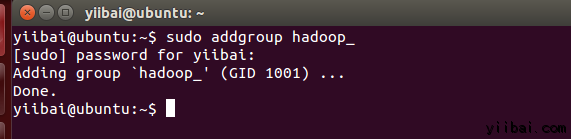  使用以下命令来添加用户：

```
yiibai@ubuntu:~$ sudo adduser --ingroup hadoop_ hduser_
```

输入您的密码，姓名和其他详细信息。 

### 二、配置SSH

为了在集群管理节点，Hadoop需要SSH访问

首先，切换用户，输入以下命令：

```
yiibai@ubuntu:~$ su hduser_
```

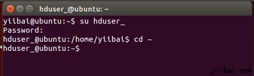

以下这个命令将创建一个新的密钥。

```
hduser_@ubuntu:~$ ssh-keygen -t rsa -P ""
```

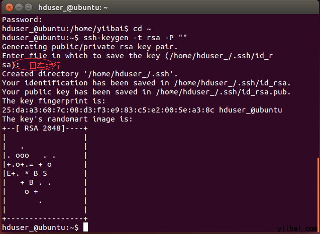

使用此密钥启用SSH访问本地计算机。

```
hduser_@ubuntu:~$ cat /home/hduser_/.ssd/id_rsa.pub >> /home/hduser_/.ssh/authorized_keys
```

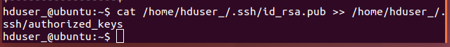

现在，测试SSH设置通过“hduser”用户连接到locahost。

```
hduser_@ubuntu:~$ ssh localhost
```

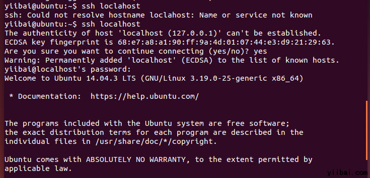

注意：

请注意，执行  'ssh localhost' 命令后如果看到下面的错误响应,  可能 SSH 在此系统不可用。

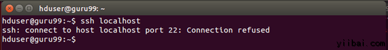

来解决上面这个问题，安装 SSH 服务 -

清除 SSH 使用以下命令：

```
hduser_@ubuntu:~$ sudo apt-get purge openssh-server
```

在安装开始前清除 SSH 服务，这是一个很好的做法(建议)，如果遇到“

is not in the sudoers file ...“提示，请使用有sudo 的用户来执行，这里使用的用户是：yiibai 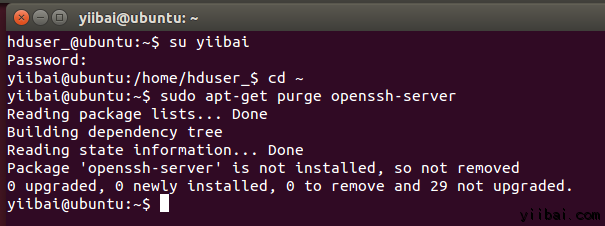 使用以下命令来安装SSH，使用以下命令：

```
yiibai@ubuntu:~$ sudo apt-get install openssh-server
```

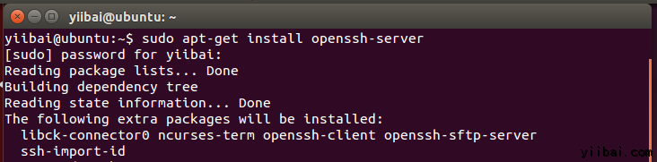

### **三、下载Hadoop** 
在浏览器中打开网址：[http://hadoop.apache.org/releases.html](http://hadoop.apache.org/releases.html) 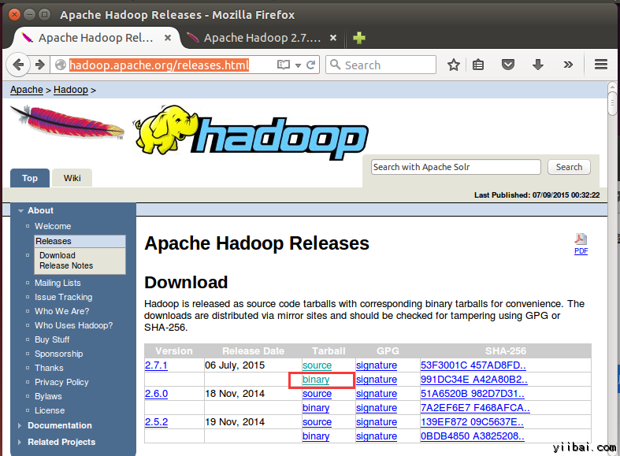 选择一个最新 2.7.1 的稳定版本(stable)的二进制包下载，如下： 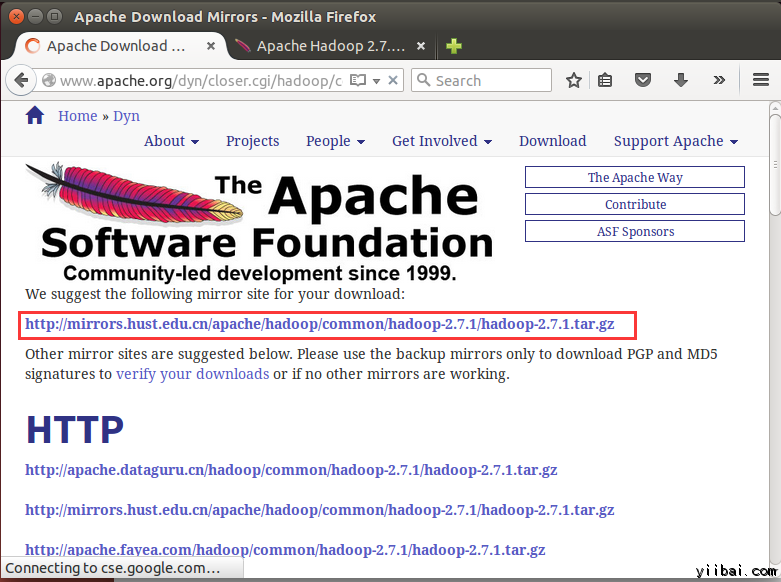


下载完成后，默认将文件放在 /home/yiibai/Downloads，如下图所示：

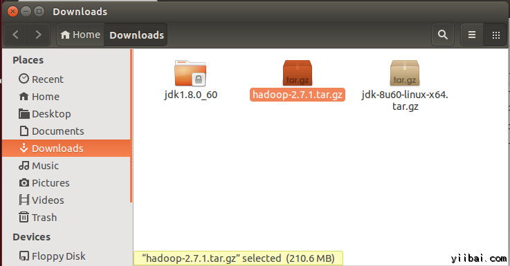

现在进入到到包含tar文件的目录，准备解压 tar.gz 文件：

```
yiibai@ubuntu:~$ cd /home/yiibai/Downloads
```

使用以下命令解压文件包： 

```
yiibai@ubuntu:~$ sudo tar xzf hadoop-2.7.1.tar.gz
```

现在重命名 hadoop-2.2.0 为 hadoop

```
yiibai@ubuntu:~$ sudo mv hadoop-2.7.1 /usr/local/hadoop
```

更改文件用户属性，执行以下命令：

```
yiibai@ubuntu:~$ cd /usr/local
yiibai@ubuntu:~$ sudo chown -R hduser_:hadoop_ hadoop
```

到这里，hadoop文件的相关工作已经准备好，接下来我们还要做一些关键的设置。

### &lt;font size="3" style="background-color: inherit;"&gt;**四、修改  ~/.bashrc 文件**&lt;/font&gt;

添加以下这些行到 ~/.bashrc 文件的末尾，内容如下所示：

| 123456 | #Set HADOOP_HOMEexport HADOOP_HOME=/usr/local/hadoop#Set JAVA_HOMEexport JAVA_HOME=/usr/local/jdk1.8.0_60# Add bin/ directory of Hadoop to PATHexport PATH=$PATH:$HADOOP_HOME/bin |

在终端下执行以下命令，打开编辑器并将上面的内容加入到文件的底部，如下图所示：

```
yiibai@ubuntu:~$ vi ~/.bashrc
```

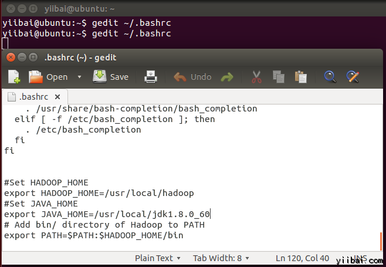

现在，使用下面的命令环境配置

```
yiibai@ubuntu:~$ . ~/.bashrc
```

### &lt;font size="3" style="background-color: inherit;"&gt;**五、配置关联HDFS**&lt;/font&gt;

设置 **JAVA_HOME **在文件 **/usr/local/hadoop/etc/hadoop/hadoop-env.sh** 中，使用以下行代替，即写上完整的 Java 安装路径。如下所示：

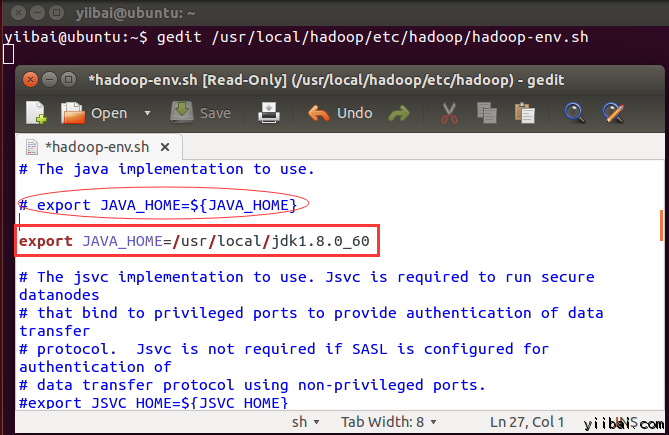

在 $HADOOP_HOME/etc/hadoop/core-site.xml 文件中还有两个参数需要设置：

1. '**hadoop.tmp.dir**' - 用于指定目录让 Hadoop 来存储其数据文件。

2\. '**fs.default.name**' - 指定默认的文件系统

为了设置两个参数，打开文件 core-site.xml

```
yiibai@ubuntu:~$ sudo gedit /usr/local/hadoop/etc/hadoop/core-site.xml
```

拷贝以下所有行的内容放入到标签 <configuration></configuration> 中间。

| 12345678910 | &lt;property&gt;    &lt;name&gt;hadoop.tmp.dir&lt;/name&gt;    &lt;value&gt;/app/hadoop/tmp&lt;/value&gt;    &lt;description&gt;Parent directory for other temporary directories.&lt;/description&gt;&lt;/property&gt;&lt;property&gt;    &lt;name&gt;fs.defaultFS &lt;/name&gt;    &lt;value&gt;hdfs://localhost:54310&lt;/value&gt;    &lt;description&gt;The name of the default file system. &lt;/description&gt;&lt;/property&gt; |

结果如下图所示：

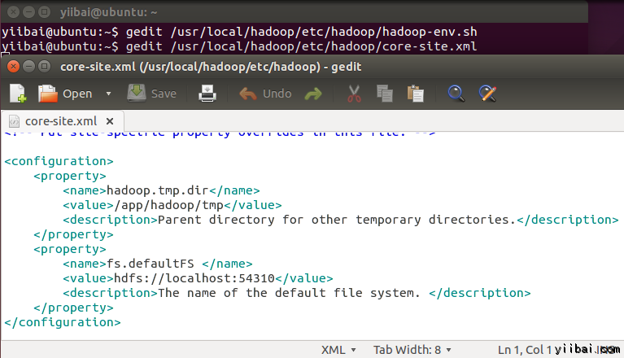

进入到目录：/usr/local/hadoop/etc/hadoop，使用如下的命令：

```
yiibai@ubuntu:~$ cd /usr/local/hadoop/etc/hadoop
yiibai@ubuntu:/usr/local/hadoop/etc/hadoop$

```

现在创建一个目录，如上面配置 core-site.xml 中使用的目录：/app/hadoop/tmp

```
yiibai@ubuntu:/usr/local/hadoop/etc/hadoop$ sudo mkdir -p /app/hadoop/tmp
```

授予权限目录 /app/hadoop/tmp，执行如下的命令：

```
yiibai@ubuntu:~$ sudo chown -R hduser_:hadoop_  /app/hadoop/tmp
yiibai@ubuntu:~$ sudo chmod 750 /app/hadoop/tmp
```

<font size="3" style="background-color: inherit;">**六、Map Reduce 配置**</font>在设置这个配置之前， 我们需要设置 HADOOP_HOME 的路径，执行以下命令：

```
yiibai@ubuntu:~$ sudo gedit /etc/profile.d/hadoop.sh
```

然后输入以下一行，

export HADOOP_HOME=/usr/local/hadoop 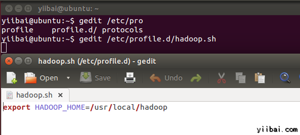

再执行以下命令：

```
yiibai@ubuntu:~$ sudo chmod +x /etc/profile.d/hadoop.sh
```

退出命令行终端再次进入，并输入以下命令：echo $HADOOP_HOME 以验证 hadoop 的路径：

```
yiibai@ubuntu:~$ echo $HADOOP_HOME
/usr/local/hadoop
```

现在复制文件，执行以下命令：

```
yiibai@ubuntu:~$ sudo cp $HADOOP_HOME/etc/hadoop/mapred-site.xml.template $HADOOP_HOME/etc/hadoop/mapred-site.xml
```

使用vi 打开文件 mapred-site.xml 

```
yiibai@ubuntu:~$ sudo vi $HADOOP_HOME/etc/hadoop/mapred-site.xml
```

添加以下的设置内容到标签`<configuration>` 和 `</configuration>` 中，如下图所示：

| 123456 | &lt;property&gt;    &lt;name&gt;mapreduce.jobtracker.address&lt;/name&gt;    &lt;value&gt;localhost:54311&lt;/value&gt;    &lt;description&gt;MapReduce job tracker runs at this host and port.    &lt;/description&gt;&lt;/property&gt; |

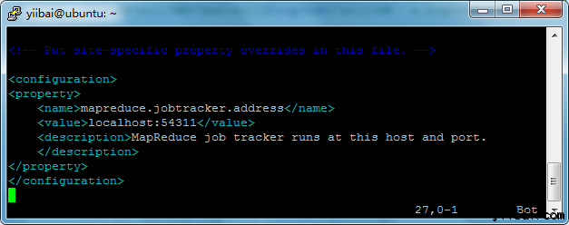


打开 $HADOOP_HOME/etc/hadoop/hdfs-site.xml 文件如下：

```
yiibai@ubuntu:~$ sudo vi $HADOOP_HOME/etc/hadoop/hdfs-site.xml
```

添加以下的设置内容到标签&lt;configuration&gt; 和 &lt;/configuration&gt; 中，如下图所示：

| 123456789 | &lt;property&gt;    &lt;name&gt;dfs.replication&lt;/name&gt;    &lt;value&gt;1&lt;/value&gt;    &lt;description&gt;Default block replication.&lt;/description&gt;&lt;/property&gt;&lt;property&gt;    &lt;name&gt;dfs.datanode.data.dir&lt;/name&gt;    &lt;value&gt;/home/hduser_/hdfs&lt;/value&gt;&lt;/property&gt; |

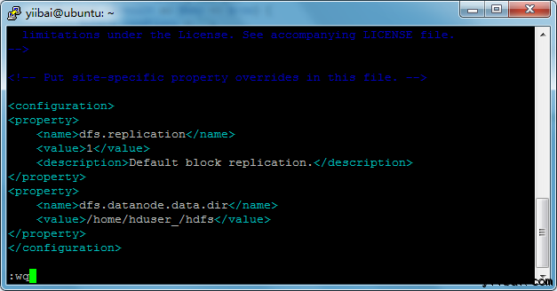

创建以上配置指定的目录并授权目录给用户，使用以下命令：

```
yiibai@ubuntu:~$ sudo mkdir -p /home/hduser_/hdfs
yiibai@ubuntu:~$ sudo chown -R hduser_:hadoop_ /home/hduser_/hdfs
yiibai@ubuntu:~$ sudo chmod 750 /home/hduser_/hdfs

```

### &lt;font size="3" style="background-color: inherit;"&gt;**七、格式化HDFS **&lt;/font&gt;

在第一使用 Hadoop 之前，需要先格式化 HDFS，使用下面的命令

```
yiibai@ubuntu:~$ $HADOOP_HOME/bin/hdfs namenode -format
```

执行结果如下图所示：


输入：y，继往下...**注：**可能会遇到一些提示错误：“java.io.IOException: Cannot create directory /app/hadoop/tmp/dfs/name/current...”，请执行以下命令来创建目录：

```
yiibai@ubuntu:~$ sudo mkdir -p /app/hadoop/tmp/dfs/name/current
yiibai@ubuntu:~$ sudo chmod -R a+w /app/hadoop/tmp/dfs/name/current/
```

### &lt;font size="3" style="background-color: inherit;"&gt;**八、 启动 Hadoop 的单节点集群**&lt;/font&gt;

使用以下命令启动cHadoop 的单节点集群(使用 hduser_ 用户来启动)，如下：

```
hduser_@ubuntu:~$ $HADOOP_HOME/sbin/start-dfs.sh
```

上面的命令输出结果如下所示：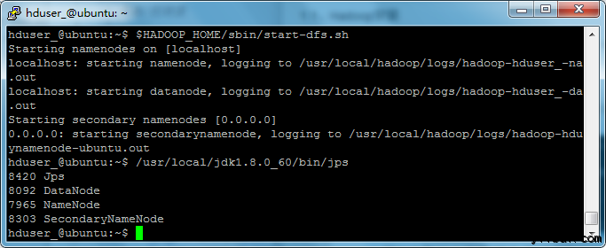接下来再执行命令：

```
hduser_@ubuntu:~$ $HADOOP_HOME/sbin/start-yarn.sh
```

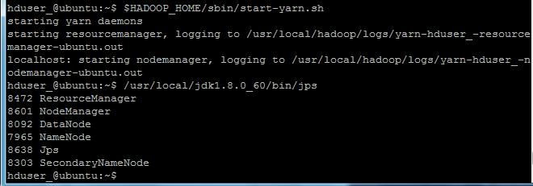

现在使用 '**jps**' 工具/命令, 验证是否所有 Hadoop 相关的进程正在运行。

```
hduser_@ubuntu:~$ /usr/local/jdk1.8.0_60/bin/jps
```

如果 Hadoop 成功启动，那么 jps 输出应显示： NameNode, NodeManager, ResourceManager, SecondaryNameNode, DataNode.**<font size="3" style="background-color: inherit;">九、停止/关闭 Hadoop</font>**

```
hduser_@ubuntu:~$ $HADOOP_HOME/sbin/stop-dfs.sh
```


```
hduser_@ubuntu:~$ $HADOOP_HOME/sbin/stop-yarn.sh
```


the end.
