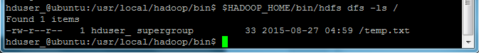

# Hadoop HDFS入门 - Hadoop教程

Hadoop 附带了一个名为 HDFS(Hadoop分布式文件系统)的分布式文件系统，基于 Hadoop 的应用程序使用 HDFS 。HDFS 是专为存储超大数据文件，运行在集群的商品硬件上。它是容错的，可伸缩的，并且非常易于扩展。    你知道吗?  当数据超过一个单个物理机器上存储的容量，除以跨独立机器数。管理跨越机器的网络存储特定操作被称为分布式文件系统。

HDFS集群主要由 NameNode 管理文件系统 Metadata 和 DataNodes 存储的实际数据。

*   **NameNode:** NameNode可以被认为是系统的主站。它维护所有系统中存在的文件和目录的文件系统树和元数据 。 两个文件：“命名空间映像“和”编辑日志“是用来存储元数据信息。Namenode 有所有包含数据块为一个给定的文件中的数据节点的知识，但是不存储块的位置持续。从数据节点在系统每次启动时信息重构一次。
*   **DataNode :** DataNodes作为从机，每台机器位于一个集群中，并提供实际的存储. 它负责为客户读写请求服务。

HDFS中的读/写操作运行在块级。HDFS数据文件被分成块大小的块，这是作为独立的单元存储。默认块大小为64 MB。

HDFS操作上是数据复制的概念，其中在数据块的多个副本被创建，分布在整个节点的群集以使在节点故障的情况下数据的高可用性。

注：  在HDFS的文件，比单个块小，不占用块的全部存储。

### 在HDFS读操作

数据读取请求将由 HDFS，NameNode和DataNode来服务。让我们把读取器叫 “客户”。下图描绘了文件的读取操作在 Hadoop 中。 

1.  客户端启动通过调用文件系统对象的 open() 方法读取请求; 它是 **DistributedFileSystem **类型的对象。
2.  此对象使用 RPC 连接到 namenode 并获取的元数据信息，如该文件的块的位置。 请注意，这些地址是文件的前几个块。
3.  响应该元数据请求，具有该块副本的 DataNodes 地址被返回。
4.  一旦接收到 DataNodes 的地址，FSDataInputStream 类型的一个对象被返回到客户端。 FSDataInputStream 包含 DFSInputStream 这需要处理交互 DataNode 和 NameNode。在上图所示的步骤4，客户端调用 read() 方法，这将导致 DFSInputStream 建立与第一个 DataNode 文件的第一个块连接。
5.  以数据流的形式读取数据，其中客户端多次调用 “read() ” 方法。 read() 操作这个过程一直持续，直到它到达块结束位置。
6.  一旦到模块的结尾，DFSInputStream 关闭连接，移动定位到下一个 DataNode 的下一个块
7.  一旦客户端已读取完成后，它会调用 close()方法。

### HDFS写操作

在本节中，我们将了解如何通过的文件将数据写入到 HDFS。 

1.  客户端通过调用 DistributedFileSystem对象的 create() 方法创建一个新的文件，并开始写操作 - 在上面的图中的步骤1
2.  DistributedFileSystem对象使用 RPC 调用连接到 NameNode，并启动新的文件创建。但是，此文件创建操作不与文件任何块相关联。NameNode 的责任是验证文件(其正被创建的)不存在，并且客户端具有正确权限来创建新文件。如果文件已经存在，或者客户端不具有足够的权限来创建一个新的文件，则抛出 IOException 到客户端。否则操作成功，并且该文件新的记录是由 NameNode 创建。
3.  一旦 NameNode 创建一条新的记录，返回FSDataOutputStream 类型的一个对象到客户端。客户端使用它来写入数据到 HDFS。数据写入方法被调用(图中的步骤3)。
4.  FSDataOutputStream包含DFSOutputStream对象，它使用 DataNodes 和 NameNode 通信后查找。当客户机继续写入数据，DFSOutputStream 继续创建这个数据包。这些数据包连接排队到一个队列被称为 DataQueue
5.  还有一个名为 DataStreamer 组件，用于消耗DataQueue。DataStreamer 也要求 NameNode 分配新的块，拣选 DataNodes 用于复制。
6.  现在，复制过程始于使用 DataNodes 创建一个管道。 在我们的例子中，选择了复制水平3，因此有 3 个 DataNodes 管道。
7.  所述 DataStreamer 注入包分成到第一个 DataNode 的管道中。
8.  在每个 DataNode 的管道中存储数据包接收并同样转发在第二个 DataNode 的管道中。
9.  另一个队列，“Ack Queue”是由 DFSOutputStream 保持存储，它们是 DataNodes 等待确认的数据包。
10.  一旦确认在队列中的分组从所有 DataNodes 已接收在管道，它从 'Ack Queue' 删除。在任何 DataNode 发生故障时，从队列中的包重新用于操作。
11.  在客户端的数据写入完成后，它会调用close()方法(第9步图中)，调用close()结果进入到清理缓存剩余数据包到管道之后等待确认。
12.  一旦收到最终确认，NameNode 连接告诉它该文件的写操作完成。

### 使用JAVA API访问HDFS

在本节中，我们来了解 Java 接口并用它们来访问Hadoop的文件系统。

为了使用编程方式与 Hadoop 文件系统进行交互，Hadoop 提供多种 Java 类。**_org.apache.hadoop.fs_ **包中包含操纵 Hadoop 文件系统中的文件类工具。这些操作包括，打开，读取，写入，和关闭。实际上，对于 Hadoop 文件 API 是通用的，可以扩展到 HDFS 的其他文件系统交互。

**编程从 HDFS 读取文件** 
java.net.URL 对象是用于读取文件的内容。首先，我们需要让 Java 识别 Hadoop 的 HDFS URL架构。这是通过调用 URL 对象的 **setURLStreamHandlerFactory**方法和 **FsUrlStreamHandlerFactory** 的一个实例琮传递给它。此方法只需要执行一次在每个JVM，因此，它被封闭在一个静态块中。

示例代码

```
publicclassURLCat {
    static{
        URL.setURLStreamHandlerFactory(newFsUrlStreamHandlerFactory());
    }
    publicstaticvoidmain(String[] args) throwsException {
        InputStream in = null;
        try{
            in = newURL(args[0]).openStream();
            IOUtils.copyBytes(in, System.out, 4096, false);
        }
        finally{
            IOUtils.closeStream(in);
        }
    }
} 
```

这段代码用于打开和读取文件的内容。HDFS文件的路径作为命令行参数传递给该程序。

### 使用命令行界面访问HDFS

这是与 HDFS 交互的最简单的方法之一。 命令行接口支持对文件系统操作，例如：如读取文件，创建目录，移动文件，删除数据，并列出目录。

可以执行 '$HADOOP_HOME/bin/hdfs dfs -help' 来获得每一个命令的详细帮助。这里, 'dfs' HDFS是一个shell命令，它支持多个子命令。首先要启动 Haddop 服务(使用 hduser_用户)，执行命令如下：

```
hduser_@ubuntu:~$ su hduser_
hduser_@ubuntu:~$ $HADOOP_HOME/sbin/start-dfs.sh
hduser_@ubuntu:~$ $HADOOP_HOME/sbin/start-yarn.sh

```

一些广泛使用的命令的列表如下

**1\. 从本地文件系统复制文件到 HDFS**

```
hduser_@ubuntu:~$ $HADOOP_HOME/bin/hdfs dfs -copyFromLocal temp.txt /
```

此命令将文件从本地文件系统拷贝 temp.txt 文件到 HDFS。

**2\. 我们可以通过以下命令列出一个目录下存在的文件_ -ls_**

```
hduser_@ubuntu:~$ $HADOOP_HOME/bin/hdfs dfs -ls /
```



我们可以看到一个文件 'temp.txt“(之前复制)被列在”/“目录。

**3\. 以下命令将文件从 HDFS 拷贝到本地文件系统**

```
hduser_@ubuntu:~$ $HADOOP_HOME/bin/hdfs dfs -copyToLocal /temp.txt
```

我们可以看到 temp.txt 已经复制到本地文件系统。

**4\. 以下命令用来创建新的目录**

```
hduser_@ubuntu:~$ $HADOOP_HOME/bin/hdfs dfs -mkdir /mydirectory
```

接下来检查是否已经建立了目录。现在，应该知道怎么做了吧？
