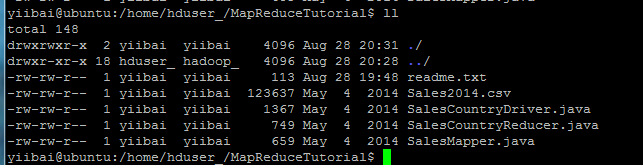
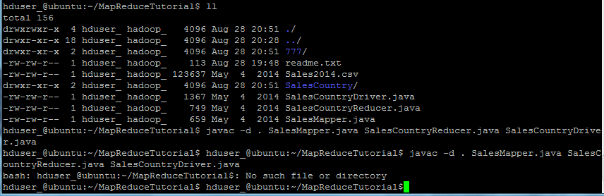
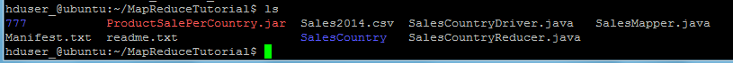
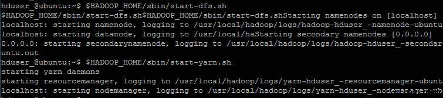
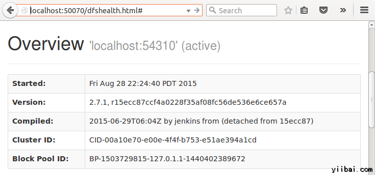
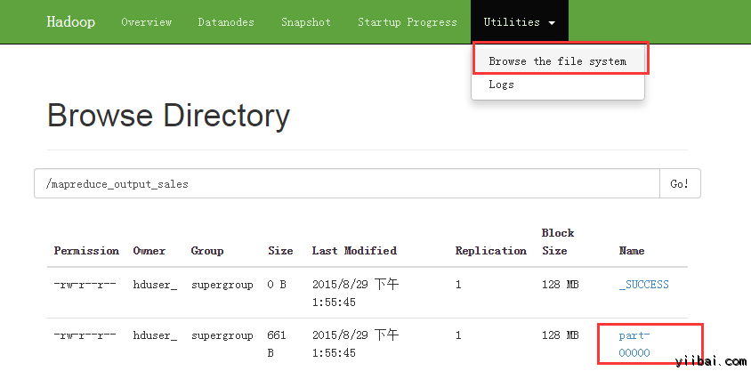
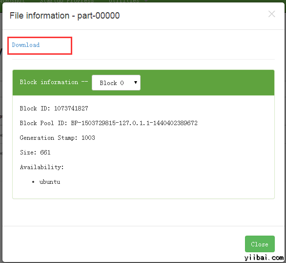

# Hadoop程序入门实践 - Hadoop教程

**问题陈述：**

找出销往各个国家商品数量。

输入: 我们的畋输入数据集合是一个 CSV 文件, Sales2014.csv

**前提条件：**

*   本教程是在Linux上开发 - Ubuntu操作系统
*   已经安装了Hadoop(本教程使用版本2.7.1)
*   系统上已安装了Java(本教程使用 JDK1.8.0)。

在实际操作过程中，使用的用户是'hduser_“(此用户使用 Hadoop)。

```
yiibai@ubuntu:~$ su hduser_
```

步骤:

1.创建一个新的目录名称是：MapReduceTutorial

```
hduser_@ubuntu:~$ sudo mkdir MapReduceTuorial
```

**授予权限**

```
hduser_@ubuntu:~$ sudo chmod -R 777 MapReduceTutorial
```


下载相关文件：[下载 Java 程序文件](http://pan.baidu.com/s/1o6EbAUQ)，拷贝以下文件：SalesMapper.java, SalesCountryReducer.java 和 SalesCountryDriver.java 到 MapReduceTutorial 目录中，

检查所有这些文件的文件权限是否正确： 

如果“读取”权限缺少可重新再授予权限，执行以下命令：

```
yiibai@ubuntu:/home/hduser_/MapReduceTutorial$ sudo chmod +r *
```

2.导出类路径

```
hduser_@ubuntu:~/MapReduceTutorial$ export CLASSPATH="$HADOOP_HOME/share/hadoop/mapreduce/hadoop-mapreduce-client-core-2.7.1.jar:$HADOOP_HOME/share/hadoop/mapreduce/hadoop-mapreduce-client-common-2.7.1.jar:$HADOOP_HOME/share/hadoop/common/hadoop-common-2.7.1.jar:~/MapReduceTutorial/SalesCountry/*:$HADOOP_HOME/lib/*"
hduser_@ubuntu:~/MapReduceTutorial$
```

3. 编译Java文件(这些文件存在于目录：Final-MapReduceHandsOn). 它的类文件将被放在包目录：

```
hduser_@ubuntu:~/MapReduceTutorial$ javac -d . SalesMapper.java SalesCountryReducer.java SalesCountryDriver.java
```



**安全地忽略此警告：**

此编译将创建一个名称与Java源文件(在我们的例子即，SalesCountry)指定包名称的目录，并把所有编译的类文件在里面，因此这个目录要在编译文件前创建。 

接下来：

创建一个新的文件：_**Manifest.txt**_

```
hduser_@ubuntu:~/MapReduceTutorial$ vi Manifest.txt
```

添加以下内容到文件中：

```
Main-Class: SalesCountry.SalesCountryDriver

```

**SalesCountry.SalesCountryDriver** 是主类的名称。请注意，必须键入回车键，在该行的末尾。

下一步：创建一个 jar 文件

```
hduser_@ubuntu:~/MapReduceTutorial$ $JAVA_HOME/bin/jar cfm ProductSalePerCountry.jar Manifest.txt SalesCountry/*.class
```

检查所创建的 jar 文件，结果如下：



6. 启动 Hadoop

```
hduser_@ubuntu:~$ $HADOOP_HOME/sbin/start-dfs.sh
hduser_@ubuntu:~$ $HADOOP_HOME/sbin/start-yarn.sh
```

 7. 拷贝文件 _**Sales2014.csv**_ 到**_ ~/inputMapReduce_**

```
hduser_@ubuntu:~$ mkdir inputMapReduce
hduser_@ubuntu:~$ cp MapReduceTutorial/Sales2014.csv ./inputMapReduce/Sales2014.csv

```

现在使用以下命令来拷贝 ~/inputMapReduce 到 HDFS.

```
hduser_@ubuntu:~$ $HADOOP_HOME/bin/hdfs dfs -copyFromLocal ~/inputMapReduce /
```

我们可以放心地忽略此警告。验证文件是否真正复制没有？

```
hduser_@ubuntu:~$ $HADOOP_HOME/bin/hdfs dfs -ls /inputMapReduce
```

8. 运行MapReduce 作业

```
hduser_@ubuntu:~$ $HADOOP_HOME/bin/hadoop jar ProductSalePerCountry.jar /inputMapReduce /mapreduce_output_sales
```

这将在 HDFS 上创建一个输出目录，名为mapreduce_output_sales。此目录的文件内容将包含每个国家的产品销售。

9. 结果可以通过命令界面中可以看到

```
hduser_@ubuntu:~$ $HADOOP_HOME/bin/hdfs dfs -cat /mapreduce_output_sales/part-00000
```

结果也可以通过 Web 界面看到，打开 Web 浏览器，输入网址：http://localhost:50070/dfshealth.jsp ，结果如下： 

现在选择 'Browse the filesystem' 并导航到 /mapreduce_output_sales 如下：



打开 part-r-00000 ，如下图所示： 

下载后，查看结果内容。
