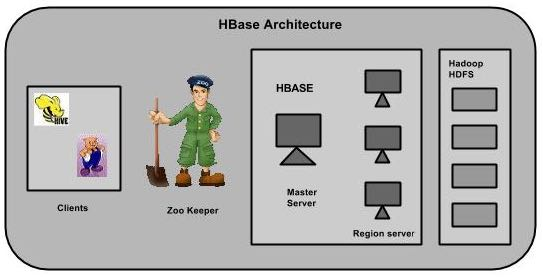
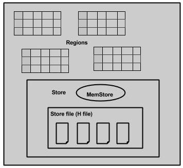

# HBase架构 - HBase教程

在HBase中，表被分割成区域，并由区域服务器提供服务。区域被列族垂直分为“Stores”。Stores被保存在HDFS文件。下面显示的是HBase的结构。

**注意：**术语“store”是用于区域来解释存储结构。

HBase有三个主要组成部分：客户端库，主服务器和区域服务器。区域服务器可以按要求添加或删除。

### 主服务器

主服务器是 -

*   分配区域给区域服务器并在Apache ZooKeeper的帮助下完成这个任务。
*   处理跨区域的服务器区域的负载均衡。它卸载繁忙的服务器和转移区域较少占用的服务器。
*   通过判定负载均衡以维护集群的状态。
*   负责模式变化和其他元数据操作，如创建表和列。

### 区域

区域只不过是表被拆分，并分布在区域服务器。

### 区域服务器

区域服务器拥有区域如下 -

*   与客户端进行通信并处理数据相关的操作。
*   句柄读写的所有地区的请求。
*   由以下的区域大小的阈值决定的区域的大小。

需要深入探讨区域服务器：包含区域和存储，如下图所示：

存储包含内存存储和HFiles。memstore就像一个高速缓存。在这里开始进入了HBase存储。数据被传送并保存在Hfiles作为块并且memstore刷新。

### Zookeeper

*   Zookeeper管理是一个开源项目，提供服务，如维护配置信息，命名，提供分布式同步等
*   Zookeeper代表不同区域的服务器短暂节点。主服务器使用这些节点来发现可用的服务器。
*   除了可用性，该节点也用于追踪服务器故障或网络分区。
*   客户端通过与zookeeper区域服务器进行通信。
*   在模拟和独立模式，HBase由zookeeper来管理。

