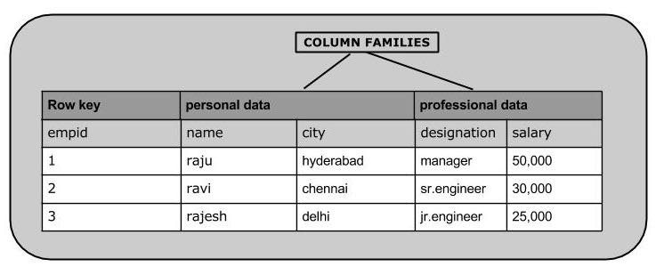

# HBase创建数据 - HBase教程

本章将介绍如何在HBase表中创建的数据。要在HBase表中创建的数据，可以下面的命令和方法：

*   **put **命令,
*   **add() - **Put类的方法
*   **put() - **HTable 类的方法.

作为一个例子，我们将在HBase中创建下表。



使用put命令，可以插入行到一个表。它的语法如下：

```
put ’<table name>’,’row1’,’<colfamily:colname>’,’<value>’
```

### 插入第一行

将第一行的值插入到emp表如下所示。

```
hbase(main):005:0> put 'emp','1','personal data:name','raju'
0 row(s) in 0.6600 seconds
hbase(main):006:0> put 'emp','1','personal data:city','hyderabad'
0 row(s) in 0.0410 seconds
hbase(main):007:0> put 'emp','1','professional
data:designation','manager'
0 row(s) in 0.0240 seconds
hbase(main):007:0> put 'emp','1','professional data:salary','50000'
0 row(s) in 0.0240 seconds

```

以相同的方式使用put命令插入剩余的行。如果插入完成整个表格，会得到下面的输出。

```
hbase(main):022:0> scan 'emp'

   ROW                        COLUMN+CELL
1 column=personal data:city, timestamp=1417524216501, value=hyderabad

1 column=personal data:name, timestamp=1417524185058, value=ramu

1 column=professional data:designation, timestamp=1417524232601,

 value=manager

1 column=professional data:salary, timestamp=1417524244109, value=50000

2 column=personal data:city, timestamp=1417524574905, value=chennai

2 column=personal data:name, timestamp=1417524556125, value=ravi

2 column=professional data:designation, timestamp=1417524592204,

 value=sr:engg

2 column=professional data:salary, timestamp=1417524604221, value=30000

3 column=personal data:city, timestamp=1417524681780, value=delhi

3 column=personal data:name, timestamp=1417524672067, value=rajesh

3 column=professional data:designation, timestamp=1417524693187,

value=jr:engg
3 column=professional data:salary, timestamp=1417524702514,

value=25000 
```

## 使用Java API插入数据

可以使用Put 类的add()方法将数据插入到HBase。可以使用HTable类的put()方法保存数据。这些类属于org.apache.hadoop.hbase.client包。下面给出的步骤是在一个HBase表创建数据。

### 第1步：实例化配置类

Configuration类增加了 HBase 配置文件到它的对象。使用HbaseConfiguration类的create()方法，如下图所示的配置对象。

```
Configuration conf = HbaseConfiguration.create();
```

### 第2步：实例化HTable类

有一类名为HTable，在HBase中实现了Table。这个类用于单个HBase表进行通信。在这个类实例接受配置对象和表名作为参数。可以实例HTable类，如下图所示。

```
HTable hTable = new HTable(conf, tableName);
```

### 第3步：实例化Put类

为了将数据插入到HBase表中，需要使用add()方法和变体。这种方法属于Put类，因此实例化Put类。这个类必须要以字符串格式的列名插入数据。可以实例Put类，如下图所示。

```
Put p = new Put(Bytes.toBytes("row1"));
```

### 第4步：插入数据

Put类的add()方法用于插入数据。它需要代表列族，分别为：列限定符（列名称）3字节阵列，以及要插入的值。使用add()方法将数据插入HBase表如下图所示。

```
p.add(Bytes.toBytes("coloumn family "), Bytes.toBytes("column
name"),Bytes.toBytes("value"));
```

### 第5步：保存数据到表中

插入所需的行后，HTable类put实例的put()方法添加，如下所示保存更改。

```
hTable.put(p); 
```

### 第6步：关闭HTable实例

创建在HBase的表数据之后，使用close()方法，如下所示关闭HTable实例。

```
hTable.close(); 
```

下面给出的是在HBase的表创建数据的完整程序。

```
import java.io.IOException;

import org.apache.hadoop.conf.Configuration;

import org.apache.hadoop.hbase.HBaseConfiguration;
import org.apache.hadoop.hbase.client.HTable;
import org.apache.hadoop.hbase.client.Put;
import org.apache.hadoop.hbase.util.Bytes;

public class InsertData{

   public static void main(String[] args) throws IOException {

      // Instantiating Configuration class
      Configuration config = HBaseConfiguration.create();

      // Instantiating HTable class
      HTable hTable = new HTable(config, "emp");

      // Instantiating Put class
      // accepts a row name.
      Put p = new Put(Bytes.toBytes("row1")); 

      // adding values using add() method
      // accepts column family name, qualifier/row name ,value
      p.add(Bytes.toBytes("personal"),
      Bytes.toBytes("name"),Bytes.toBytes("raju"));

      p.add(Bytes.toBytes("personal"),
      Bytes.toBytes("city"),Bytes.toBytes("hyderabad"));

      p.add(Bytes.toBytes("professional"),Bytes.toBytes("designation"),
      Bytes.toBytes("manager"));

      p.add(Bytes.toBytes("professional"),Bytes.toBytes("salary"),
      Bytes.toBytes("50000"));

      // Saving the put Instance to the HTable.
      hTable.put(p);
      System.out.println("data inserted");

      // closing HTable
      hTable.close();
   }
}
```

编译和执行上述程序如下所示。

```
$javac InsertData.java
$java InsertData
```

下面列出的是输出结果：

```
data inserted
```

