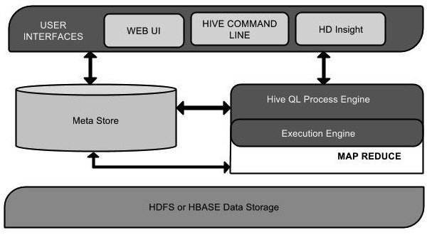
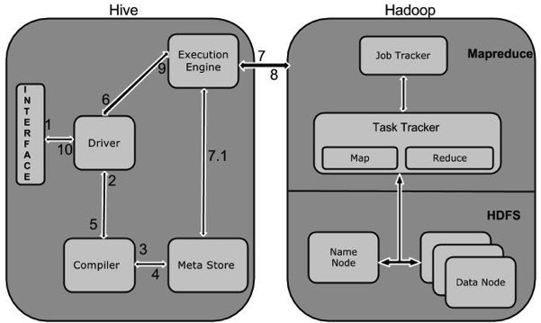

# Hive教程

Hive是一个数据仓库基础工具在Hadoop中用来处理结构化数据。它架构在[Hadoop](http://www.yiibai.com/hadoop/)之上，总归为大数据，并使得查询和分析方便。并提供简单的sql查询功能，可以将sql语句转换为MapReduce任务进行运行。

术语“大数据”是大型数据集，其中包括体积庞大，高速，以及各种由与日俱增的数据的集合。使用传统的数据管理系统，它是难以加工大型数据。因此，Apache软件基金会推出了一款名为Hadoop的解决大数据管理和处理难题的框架。

## Hadoop

Hadoop是一个开源框架来存储和处理大型数据在分布式环境中。它包含两个模块，一个是MapReduce，另外一个是Hadoop分布式文件系统（HDFS）。

*   **MapReduce：**它是一种并行编程模型在大型集群普通硬件可用于处理大型结构化，半结构化和非结构化数据。

*   **HDFS：**Hadoop分布式文件系统是Hadoop的框架的一部分，用于存储和处理数据集。它提供了一个容错文件系统在普通硬件上运行。

Hadoop生态系统包含了用于协助Hadoop的不同的子项目（工具）模块，如Sqoop, Pig 和 Hive。

*   **Sqoop: **它是用来在HDFS和RDBMS之间来回导入和导出数据。

*   **Pig:** 它是用于开发MapReduce操作的脚本程序语言的平台。

*   **Hive:** 它是用来开发SQL类型脚本用于做MapReduce操作的平台。

注：有多种方法来执行MapReduce作业：

*   传统的方法是使用Java MapReduce程序结构化，半结构化和非结构化数据。
*   针对MapReduce的脚本的方式，使用Pig来处理结构化和半结构化数据。
*   Hive查询语言（HiveQL或HQL）采用Hive为MapReduce的处理结构化数据。

## Hive是什么？

Hive是一个数据仓库基础工具在Hadoop中用来处理结构化数据。它架构在Hadoop之上，总归为大数据，并使得查询和分析方便。

最初，Hive是由Facebook开发，后来由Apache软件基金会开发，并作为进一步将它作为名义下Apache Hive为一个开源项目。它用在好多不同的公司。例如，亚马逊使用它在 Amazon Elastic MapReduce。

### Hive 不是

*   一个关系数据库
*   一个设计用于联机事务处理（OLTP）
*   实时查询和行级更新的语言

## Hiver特点

*   它存储架构在一个数据库中并处理数据到HDFS。
*   它是专为OLAP设计。
*   它提供SQL类型语言查询叫HiveQL或HQL。
*   它是熟知，快速，可扩展和可扩展的。

## Hive架构

下面的组件图描绘了Hive的结构：

该组件图包含不同的单元。下表描述每个单元：

| 单元名称 | 操作 |
| --- | --- |
| 用户接口/界面 | Hive是一个数据仓库基础工具软件，可以创建用户和HDFS之间互动。用户界面，Hive支持是Hive的Web UI，Hive命令行，HiveHD洞察（在Windows服务器）。 |
| 元存储 | Hive选择各自的数据库服务器，用以储存表，数据库，列模式或元数据表，它们的数据类型和HDFS映射。 |
| HiveQL处理引擎 | HiveQL类似于SQL的查询上Metastore模式信息。这是传统的方式进行MapReduce程序的替代品之一。相反，使用Java编写的MapReduce程序，可以编写为MapReduce工作，并处理它的查询。 |
| 执行引擎 | HiveQL处理引擎和MapReduce的结合部分是由Hive执行引擎。执行引擎处理查询并产生结果和MapReduce的结果一样。它采用MapReduce方法。 |
| HDFS 或 HBASE | Hadoop的分布式文件系统或者HBASE数据存储技术是用于将数据存储到文件系统。 |

## Hive工作原理

下图描述了Hive 和Hadoop之间的工作流程。

下表定义Hive和Hadoop框架的交互方式：

| Step No. | 操作 |
| --- | --- |
| 1 | **Execute Query**Hive接口，如命令行或Web UI发送查询驱动程序（任何数据库驱动程序，如JDBC，ODBC等）来执行。 |
| 2 | **Get Plan**在驱动程序帮助下查询编译器，分析查询检查语法和查询计划或查询的要求。 |
| 3 | **Get Metadata**编译器发送元数据请求到Metastore（任何数据库）。 |
| 4 | **Send Metadata**Metastore发送元数据，以编译器的响应。 |
| 5 | **Send Plan**编译器检查要求，并重新发送计划给驱动程序。到此为止，查询解析和编译完成。 |
| 6 | **Execute Plan**驱动程序发送的执行计划到执行引擎。 |
| 7 | **Execute Job**在内部，执行作业的过程是一个MapReduce工作。执行引擎发送作业给JobTracker，在名称节点并把它分配作业到TaskTracker，这是在数据节点。在这里，查询执行MapReduce工作。 |
| 7.1 | **Metadata Ops**与此同时，在执行时，执行引擎可以通过Metastore执行元数据操作。 |
| 8 | **Fetch Result**执行引擎接收来自数据节点的结果。 |
| 9 | **Send Results**执行引擎发送这些结果值给驱动程序。 |
| 10 | **Send Results**驱动程序将结果发送给Hive接口。 |

