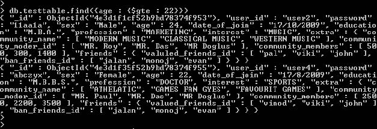
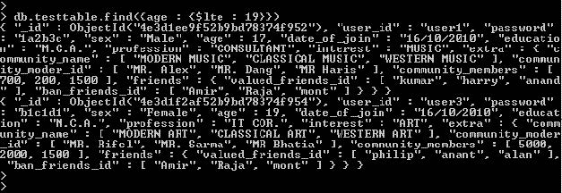
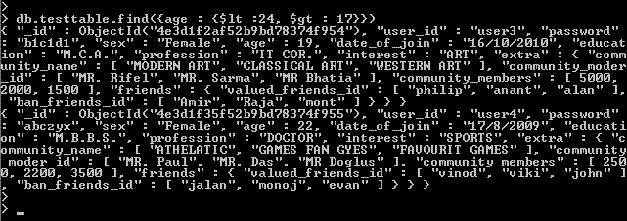

# MongoDB条件操作符

## 描述

条件操作符用于比较两个表达式并从mongoDB集合中获取数据。

在本章节中，我们将讨论如何在MongoDB中使用条件操作符。

MongoDB中条件操作符有：

*   (&gt;) 大于 - $gt
*   (&lt;) 小于 - $lt
*   (&gt;=) 大于等于 - $gte
*   (&lt;= ) 小于等于 - $lte

**我们使用的数据库名称为"myinfo" 我们的集合名称为"testtable"，以下为我们插入的数据。**

简单的集合"testtable"：


## MongoDB (&gt;) 大于操作符 - $gt

如果你想获取"testtable"集合中"age" 大于22的数据，你可以使用以下命令：

```
> db.testtable.find({age : {$gt : 22}})
```

类似于SQL语句：

```
Select * from testtable where age >22;
```

输出结果：


## MongoDB（&gt;=）大于等于操作符 - $gte

如果你想获取"testtable"集合中"age" 大于等于22的数据，你可以执行以下命令:

```
> db.testtable.find({age : {$gte : 22}})
```

类似于SQL语句：

```
Select * from testtable where age >=22;
```

输出结果：



## MongoDB (&lt;) 小于操作符 - $lt

如果你想获取"testtable"集合中"age" 小于19的数据，你可以执行以下命令：

类似于SQL语句：

```
Select * from testtable where age <19;
```

输出结果：


## MongoDB (&lt;=) 小于操作符 - $lte

如果你想获取"testtable"集合中"age" 小于等于19的数据，你可以执行以下命令：

```
> db.testtable.find({age : {$lte : 19}})
```

类似于SQL语句：

```
Select * from testtable where age <=19;
```

输出结果：



## MongoDB 使用 (&lt;) 和 (&gt;) 查询operator - $lt 和 $gt

如果你想获取"testtable"集合中"age" 大于17以及小于24的数据，你可以执行以下命令：

```
> db.testtable.find({age : {$lt :24, $gt : 17}})
```

类似于SQL语句：

```
Select * from testtable where age 17;
```

输出结果：




