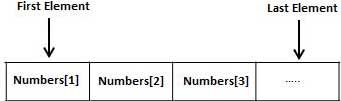

# PL/SQL数组 - PL/SQL教程

PL/SQL程序设计语言提供叫一种叫做VARRAY的数据结构，其可存储相同类型元素的一个固定大小的连续集合。VARRAY用于存储数据的有序集合，但它往往是更加有用认为数组作为相同类型的变量的集合。

所有可变数组由连续的存储位置。最低的地址对应于第一元素和最高地址的最后一个元素。



数组是所有集合类型数据的一部分，并且它代表了可变大小的的阵列。我们将研究其他集合类型在后面的“PL/SQL集合”章节。

在一个VARRAY每个元素都有与其相关联的索引。它还具有可以动态改变一个最大大小。

## 创建VARRAY类型

一个VARRAY类型是用CREATE TYPE语句创建。必须指定最大长度，并存储在VARRAY元素的类型。

对于在架构层面创造一个VRRAY类型的基本语法：

```
CREATE OR REPLACE TYPE varray_type_name IS VARRAY(n) of <element_type>
```

这里,

*   varray_type_name 就是一个有效的属性名

*   n是VARRAY元素（最大值）的数目

*   element_type 就是所述数组的元素的数据类型。

VARRAY的最大长度可以使用ALTER TYPE语句来改变。

例如,

```
CREATE Or REPLACE TYPE namearray AS VARRAY(3) OF VARCHAR2(10);
/

Type created.
```

PL/SQL块创建VRRAY类型的基本语法：

```
TYPE varray_type_name IS VARRAY(n) of <element_type>
```

示例,

```
TYPE namearray IS VARRAY(5) OF VARCHAR2(10);
Type grades IS VARRAY(5) OF INTEGER;
```

## 示例 1

下面的程序说明了使用可变数组：

```
DECLARE
   type namesarray IS VARRAY(5) OF VARCHAR2(10);
   type grades IS VARRAY(5) OF INTEGER;
   names namesarray;
   marks grades;
   total integer;
BEGIN
   names := namesarray('Kavita', 'Pritam', 'Ayan', 'Rishav', 'Aziz');
   marks:= grades(98, 97, 78, 87, 92);
   total := names.count;
   dbms_output.put_line('Total '|| total || ' Students');
   FOR i in 1 .. total LOOP
      dbms_output.put_line('Student: ' || names(i) || '
      Marks: ' || marks(i));
   END LOOP;
END;
/
```

当上述代码在SQL提示符执行时，它产生了以下结果：

```
Student: Kavita  Marks: 98
Student: Pritam  Marks: 97
Student: Ayan  Marks: 78
Student: Rishav  Marks: 87
Student: Aziz  Marks: 92

PL/SQL procedure successfully completed.

```

请注意：

*   在Oracle环境中，可变数组的起始索引始终为1

*   可以初始化使用VARRAY类型，它具有相同的名称变长数组的构造方法VARRAY元素

*   可变数组是一维阵列

*   一个VARRAY当它被声明自动为NULL值，必须初始化之前，它的元素可以被引用

## 示例 2

VARRAY的元素也可以是任何％TYPE任何数据库表或％ROWTYPE数据库表的字段。下面的例子说明了这个概念：

我们将使用存储在数据库中的CUSTOMERS表：

```
Select * from customers;

+----+----------+-----+-----------+----------+
| ID | NAME     | AGE | ADDRESS   | SALARY   |
+----+----------+-----+-----------+----------+
|  1 | Ramesh   |  32 | Ahmedabad |  2000.00 |
|  2 | Khilan   |  25 | Delhi     |  1500.00 |
|  3 | kaushik  |  23 | Kota      |  2000.00 |
|  4 | Chaitali |  25 | Mumbai    |  6500.00 |
|  5 | Hardik   |  27 | Bhopal    |  8500.00 |
|  6 | Komal    |  22 | MP        |  4500.00 |
+----+----------+-----+-----------+----------+
```

以下是使用游标示例：

```
DECLARE
   CURSOR c_customers is
   SELECT  name FROM customers;
   type c_list is varray (6) of customers.name%type;
   name_list c_list := c_list();
   counter integer :=0;
BEGIN
   FOR n IN c_customers LOOP
      counter := counter + 1;
      name_list.extend;
      name_list(counter)  := n.name;
      dbms_output.put_line('Customer('||counter ||'):'||name_list(counter));
   END LOOP;
END;
/
```

当上述代码在SQL提示符执行时，它产生了以下结果：

```
Customer(1): Ramesh 
Customer(2): Khilan 
Customer(3): kaushik    
Customer(4): Chaitali 
Customer(5): Hardik 
Customer(6): Komal

PL/SQL procedure successfully completed.
```

