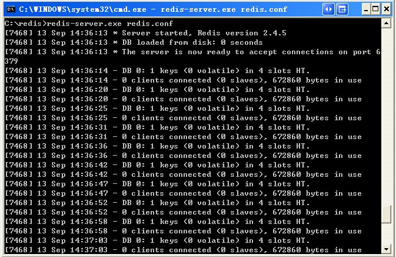
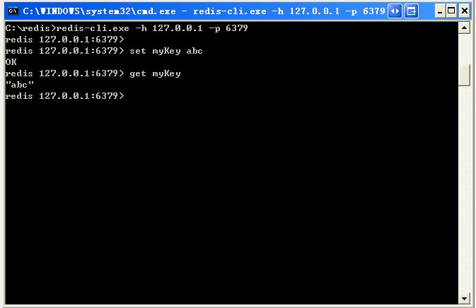

# Redis 安装

## Window 下安装

**下载地址：**[https://github.com/dmajkic/redis/downloads](https://github.com/dmajkic/redis/downloads)。

下载到的Redis支持32bit和64bit。根据自己实际情况选择，将64bit的内容cp到自定义盘符安装目录取名redis。 如 C:\reids

打开一个cmd窗口 使用cd命令切换目录到 C:\redis 运行 **redis-server.exe redis.conf** 。

如果想方便的话，可以把redis的路径加到系统的环境变量里，这样就省得再输路径了，后面的那个redis.conf可以省略，如果省略，会启用默认的。输入之后，会显示如下界面：



这时候别启一个cmd窗口，原来的不要关闭，不然就无法访问服务端了。

切换到redis目录下运行 **redis-cli.exe -h 127.0.0.1 -p 6379** 。

设置键值对 **set myKey abc**

取出键值对 **get myKey**



## Linux 下安装

**下载地址：**[http://redis.io/download](//redis.io/download)，下载最新文档版本。

本教程使用的最新文档版本为 2.8.17，下载并安装：

```
$ wget http://download.redis.io/releases/redis-2.8.17.tar.gz
$ tar xzf redis-2.8.17.tar.gz
$ cd redis-2.8.17
$ make

```

make完后 redis-2.8.17目录下会出现编译后的redis服务程序redis-server,还有用于测试的客户端程序redis-cli

下面启动redis服务.

```
$ ./redis-server

```

注意这种方式启动redis 使用的是默认配置。也可以通过启动参数告诉redis使用指定配置文件使用下面命令启动。

```
$ ./redis-server redis.conf

```

redis.conf是一个默认的配置文件。我们可以根据需要使用自己的配置文件。

启动redis服务进程后，就可以使用测试客户端程序redis-cli和redis服务交互了。 比如：

```
$ ./redis-cli
redis> set foo bar
OK
redis> get foo
"bar"

```

## Ubuntu 下安装

在 Ubuntu 系统安装 Redi 可以使用以下命令:

```
$sudo apt-get update
$sudo apt-get install redis-server

```

### 启动 Redis

```
$redis-server

```

### 查看 redis 是否启动？

```
$redis-cli

```

以上命令将打开以下终端：

```
redis 127.0.0.1:6379>

```

127.0.0.1 是本机 IP ，6379 是 redis 服务端口。现在我们输入 PING 命令。

```
redis 127.0.0.1:6379> ping
PONG

```

以上说明我们已经成功安装了redis。

