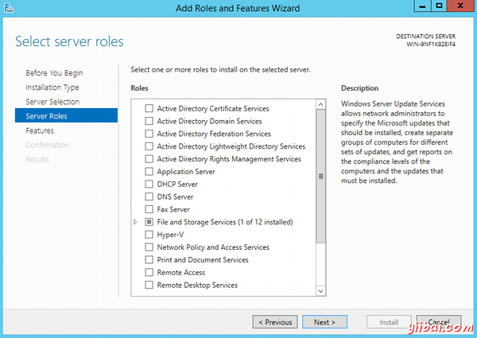
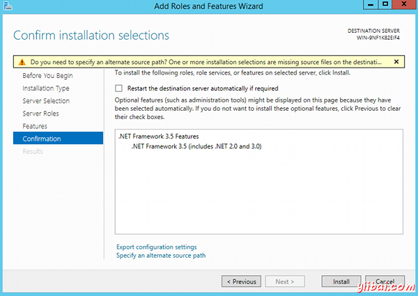
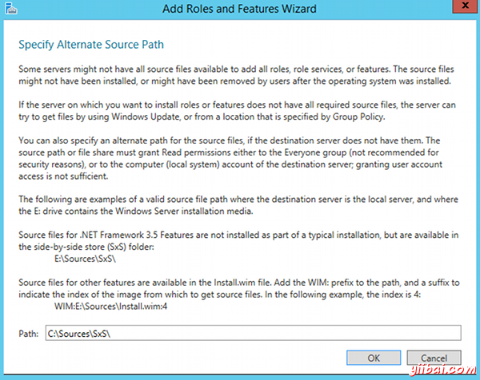

# Windows2012 R2上安装.NET3.5框架 - SQL Server教程

如果你[安装SQL Server2014](http://www.quackit.com/sql_server/sql_server_2014/tutorial/sql_server_installation.html)(或任意数量的其他应用软件)， 可能会发现必须要安装.NET3.5框架，然后才能进行下一步。

您可能在安装SQL Server2014或在进行中时。如果去安装.NET3.5框架，你将需要保持SQL Server安装保持窗口打开。因此，建议您首先安装.NET3.5框架。

以下是可以将.NET3.5框架安装到你的服务器。

1.  打开服务器管理器
2.  单击管理，然后选择添加角色和功能
3.  添加角色和功能向导将会出现。点击下一步
4.  在选择安装类型屏幕上，选择基于角色的或基于功能的安装，然后单击下一步。
5.  选择要安装.NET3.5，然后单击下一步服务器： 
6.  在选择服务器角色屏幕上，单击Next，不用做任何选择： 
7.  在选择功能屏幕，检查.NET Framework 3.5的功能，然后单击下一步： 
8.  在确认安装选择屏读取警告，将显示你需要指定一个备用源路径。如果目标计算机不能访问到Windows Update，单击指定备用源路径链接（在对话框的底部）： 
9.  指定的路径安装媒体上的sourcessxs文件夹，然后单击确定只有当你不得不指定一个备用路径执行此步骤。:
10.  在您指定的备用电源，或者如果目标计算机能够访问Windows更新，关闭警告（点击X），然后单击安装。
11.  一旦.NET Framework 3.5已经安装时，屏幕会告诉你（计算机名称）安装成功。点击关闭（可以继续查找所需要的.NET Framework3.5）： 

