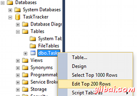
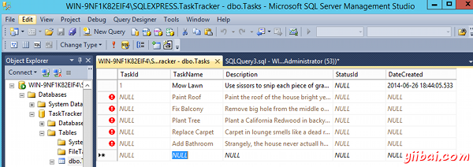
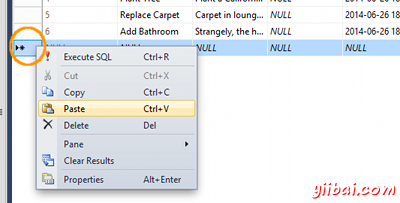
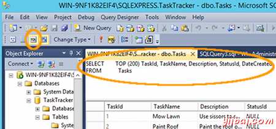
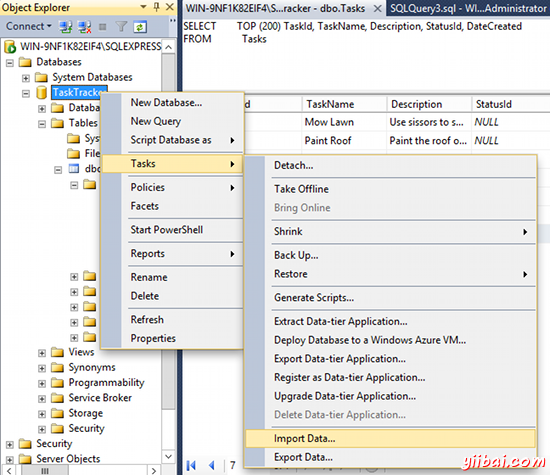

# SQL Server添加数据 - SQL Server教程

在前面的教训，我们在我们的数据库中创建一个表。我们现在有一个数据库，一张表......但没有数据。

获取数据到数据库有许多方式。以下是主要的方法：

*   **手动:** 直接输入数据到表行。
*   **复制/粘贴:** 类似于以前的选项，但是这一次是从其他来源的数据复制，然后粘贴到你的数据库中的表。
*   **导入:** 可以使用导入和导出向导从另一个源导入数据。
*   **SQL脚本:** 可以运行一个包含所有数据插入SQL脚本。
*   **应用/网站:** 使用者通过下列方式：应用程序或网站更新数据库。

这里是每个这些方法的更多细节介绍。

## 手动

我们可以使用编辑前200行选项手动直接输入数据到表行。

手动输入的数据是确定的，如果数据一点点进入。但它是一个有点笨重，可以不切实际，如果是大量的数据。 再加上它并没有真正满足大多数业务需求，其中非技术用户需要能够更新数据库。

在任何情况下，这里显示如何手工直接输入数据到表：

1.  在对象资源管理器中，右键点击你要打开的表，然后选择编辑前200行： 
2.  现在你可以开始直接输入数据到表中。

    需要注意的是在使用我们刚刚创建的表，我们并不需要输入数据到TaskId 和dateCreated这两列。 这是因为他们将被自动填充（请记住，我们设置TASKID是唯一标识并且dateCreated会以（GetDate()））填充。 无需为StatusId输入任何东西，因为我们还没有创建状态表，再加上我们的表设计使该字段为空（我们选择允许空值）。

    

## 复制/粘贴

可以通过从另一数据源复制并粘贴到数据库表使用类似的方法，以上述内容。当然，这将需要在源表具有相同的列的目标表。类似于上面的手动方法中，这是行一个小数量的记录，但不适合大量的记录。

以下是如何复制/粘贴到表：

1.  从数据源所需的所有记录
2.  在目标数据库（例如：一个要填充数据），目标表上单击鼠标右键，然后选择编辑前200行
3.  在最左边的列（它更是一个按钮，最左边的列的左侧，可以选择整个行），然后从上下文菜单中选择粘贴，选择通过右键单击一个空行： 

如果需要粘贴超过200行，单击显示SQL窗格图标，从工具栏中显示的SQL语句显示后面200行。简单地根据需要在200改变为行的数量较多。

需要注意的是，这种方式可在一定程度上，但你可能会遇到这么多数据传输需要执行多次，或需要使用其他方法。

## 导入

可以从另一个数据源导入数据。最终的结果是相似的拷贝/粘贴方法（即数据在到目标数据库中复制），但在导入数据更加灵活，可以更合适于许多场合。例如，您可以选择从多个视图和表中的数据，可以写一个查询就可以导入需要的数据。

要导入数据，在数据库上单击鼠标右键，并选择Tasks &gt; Import Data... 并从那里按照向导执行操作。

在SQL Server导入和导出向导数据，可以将数据复制到并从其中一个托管的.NET Framework数据提供程序或本机OLE DB提供程序可用的任何数据源。这些包括：

*   SQL Server
*   普通文件
*   Microsoft Office Access
*   Microsoft Office Excel

您也可以从Windows开始菜单中启动SQL Server导入和导出向导，从内部SQL Server数据工具（SSDT），并通过在命令提示符（通过运行DTSWizard.exe，你可能会找到在：C:Program FilesMicrosoft SQL Server100DTSBinn or inC:Program FilesMicrosoft SQL Server120DTSBinn 或其他位置，具体取决于您的配置和驱动器盘符）。

## SQL脚本

在很多情况下，你会发现它更有效地运行包含需要插入数据的SQL脚本。您可以使用SQL INSERT语句插入语句，指定数据。

SQL脚本是伟大的静态插入/引用数据（如说，国家/地区）。它们可以存储并重新运行需要它的任何时间（例如在另一数据库）。脚本通常不进行数据的不断变化（如客户详细信息）那么好。你可能不会被保留过时的数据在一个副本的SQL脚本。但总有例外。例如，你可以使用这样一个脚本来填充客户表，用于测试/开发环境。

更多关于SQL脚本来了。

## 应用/网站

大多数的SQL Server数据库后端数据存储为一个前端应用程序。该应用程序的用户负责将数据添加到数据库（以编辑）。 因此，许多表中您的数据库将通过应用程序进行更新。在这种情况下，应用程序被更新是使用SQL脚本到数据库。

这些脚本和那些我们上面讨论的区别在于，在应用程序正在使用的脚本将是动态的。他们将接受数据作为传递给脚本的参数。因此，用户可以输入，电子邮件地址到应用程序中，但他并不知情在应用程序运行的SQL脚本，需要他的电子邮件地址，验证它，把它添加到脚本，如果通过了所有的业务/验证规则，最后将其插入到数据库中。

这些SQL脚本可以直接放置到您的网站的代码（PHP，ColdFusion的等），也可以将它们存储在数据库中的存储过程或视图。

看到作为SQL脚本SQL服务器（以及大多数其他数据库管理系统），这样的一个组成部分，接下来我们将仔细看看[SQL脚本](http://www.yiibai.com/sql_server/sql_scripts.html)。 

