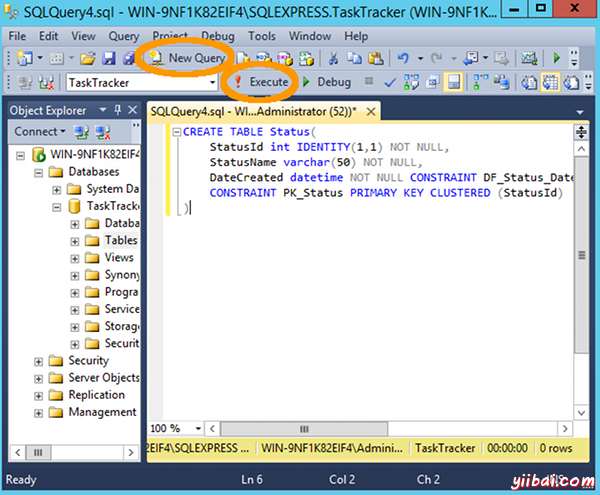
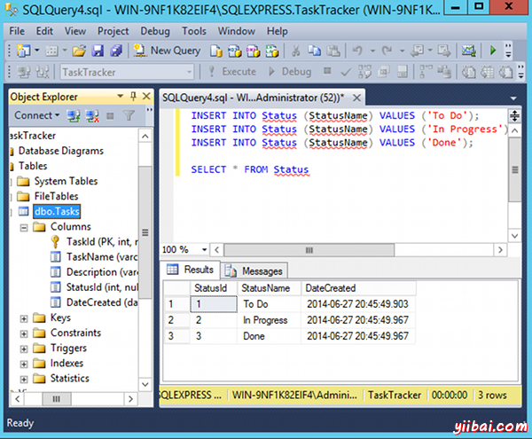
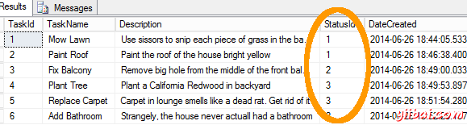

# SQL Server SQL脚本 - SQL Server教程

在前面的课程，我们使用“编辑前200行”选项添加数据到我们的数据库表。在这一课中，我们将着眼于如何编写SQL脚本来更新并运行对数据库进行查询。

SQL脚本可用于插入数据，读取数据，更新数据，和删除数据。它们也可以用于创建数据库对象，如表，视图，存储过程，他们甚至可以用于创建整个数据库本身 - 完整的表，数据，用户，等等。

## Transact-SQL

SQL Server支持的、Transact-SQL作为脚本语言。 Transact-SQL是基于SQL（结构化查询语言），它是用于应用程序和它们的数据库之间的接口的编程语言。Transact-SQL是一个相对容易的语言学习，我强烈建议熟悉它。在这里每当指SQL脚本，意思就是一个Transact-SQL脚本。

## SQL语句

SQL脚本通常由一个或多个“语句”。每个语句告诉SQL Server该怎么做。

SQL脚本可以包含许多语句。例如，SQL脚本可以包含一个语句创建一个表，另一份声明将数据插入到该表，而另一份语句中，以选择所有刚刚插入到表中的数据。事实上，SQL有一个用于那些确切的三项具体语句：CREATE语句，INSERT语句和SELECT语句。

一般来说，语句开始使用想要执行的任务的指令。如果你想创建一个数据库对象时，声明开始后创建。我说：“一般来说”，因为，还有一些其他的点点滴滴，你可以在抛出一个SQL语句可能会及所希望的语句。

## SQL语句示例

也许最简单的SQL语句是学习SELECT语句。下面是在其最简单的SELECT语句的一个例子：


```
SELECT * FROM Tasks
```

上面的语句从任务表中的选择所有列。星号（*）的意思是“所有列”。上面的语句可以略作修改，只返回一个特定的列，我们可以添加一个WHERE子句来过滤数据，只有那些我们感兴趣的记录：


```
SELECT TaskName FROM Tasks
WHERE StatusId = "3"
```

上述语句选择从任务表中的TaskName列，但它只返回那些具有StatusId为3的记录。值为3可能是“To Do”或“Done”，或不管它是什么，我们只希望它表示具体的意思。在我们的TaskTracker数据库中，我们将创建一个新的表称为Status，我们将指定“3”是指什么（“1”和“2”又表示什么）。这些数字只是在StatusId字段中（我们指定为标识列 - 一个自动编号）的值。每个这些数字将在StatusName字段相应值将告诉我们实际上是什么状态。

然后，一旦我们已经创建了状态表中，我们可以修改上面的SQL语句，以包括状态表，以便我们可以编写为WHERE StatusName=“To Do”，而不是试图记住“To Do”数字是什么。

但是，我们需要首先创建我们的Status表... 

## 使用SQL脚本创建表

下面是一个SQL脚本，将在我们的数据库中另一个表- 一个名为Status表。如果不熟悉SQL它可能看起来有点怪异。 当看到列及其相应的数据类型的名称是什么，那么也就对它有一些了解。在此脚本中，我们并不容许任何NULL字段（因此NOT NULL毗邻每一列）。我们也创建了主键StatusId字段，我们设定的默认值的dateCreated字段，使用（getdate()）。

要运行此脚本，请执行以下操作：

1.  脚本复制到剪贴板
2.  在SQL Server管理套件，单击工具栏上的新建查询按钮：
3.  脚本粘贴到查询窗口
4.  点击！执行该工具栏上的按钮：

一旦脚本运行，你应该看到一条消息，读取命令已成功完成。



这里是脚本：


```
CREATE TABLE Status(
	StatusId int IDENTITY(1,1) NOT NULL,
	StatusName varchar(50) NOT NULL,
	DateCreated datetime NOT NULL CONSTRAINT DF_Status_DateCreated  DEFAULT (getdate()),
	CONSTRAINT PK_Status PRIMARY KEY CLUSTERED (StatusId)
)
```

## 键盘快捷键

**注：**也可以通过按F5键盘上运行一个查询。

另外，你甚至可以通过选择要运行的部分，然后按F5运行查询的一部分。这非常上包含大量的SQL语句的较大的脚本，但是，当由于某种原因，只要运行的一个或两个（或甚至运行所有这些，但只是一次一个）。

## 通过SQL脚本添加数据

也可以通过SQL脚本添加数据。该脚本将使用INSERT语句将数据插入到指定的表。 你可以使用脚本插入数据到所有列在表中，或者只是那些指定的表。

下面的脚本将数据插入状态表，然后选择该数据（所以我们可以看到，它进入了）。运行此脚本，你做了上述脚本）以同样的方式：


```
INSERT INTO Status (StatusName) VALUES ('To Do');
INSERT INTO Status (StatusName) VALUES ('In Progress');
INSERT INTO Status (StatusName) VALUES ('Done');

SELECT * FROM Status
```

这里是这个样子的：



正如你所看到的，查询的结果显示在底部窗格中。

### 交叉参考数据

现在，我们已经得到了Status表，让我们一值添加到任务表的StatusId字段中（还记得我们保留那个字段为空的所有记录，因为我们还没有Status表）。

所以我们增加值要任务表链接到Status表。 在任务表中的每个记录现在将有一个StatusId，它的值可能是1，2或3（在状态表的StatusId字段中匹配的值）。

要做到这一点，我们需要使用UPDATE语句（因为我们正在更新记录，而不是插入新的）。

因此，事不宜迟，让我们运行下面的脚本：


```
UPDATE Tasks
SET StatusId='1'
WHERE TaskId='1';

UPDATE Tasks
SET StatusId='1'
WHERE TaskId='2';

UPDATE Tasks
SET StatusId='2'
WHERE TaskId='3';

UPDATE Tasks
SET StatusId='3'
WHERE TaskId='4';

UPDATE Tasks
SET StatusId='3'
WHERE TaskId='5';

UPDATE Tasks
SET StatusId='2'
WHERE TaskId='6';

UPDATE Tasks
SET StatusId='1'
WHERE TaskId='7';

SELECT * FROM Tasks
```

现在应该看到其StatusId字段中填写的所有记录您的任务表，完整。应该是这样的：



## 合并脚本

事实上，我们可能只是很容易地结合上述所有脚本并运行它们为一体。我只保留了它们，才能分离出来，使其更易于了解哪些部分做什么。

如果您想了解更多关于创建SQL语句，请看看[SQL教程](http://www.yiibai.com/sql/)。

## 区分大小写

SQL不区分大小写。所以下面的语句都是执行同样的事情：

*   `SELECT * FROM TASKS`
*   `SELECT * FROM Tasks`
*   `Select * From Tasks`
*   `select * from tasks`

## 数据库管理

大多数的数据库管理任务（如创建用户，备份等），可以在SSMS通过图形用户界面进行编程，可以通过SQL脚本来执行。本教程集中使用的图形用户界面，主要是因为它通常是一个更容易为新用户得到一个简单的入门。 当你更熟悉SQL Server，就可以使用SQL脚本来执行许多任务，也可通过图形用户界面做自己的事情。

接下来，我们看一下[查询设计](http://www.yiibai.com/sql_server/query_designer.html)。

