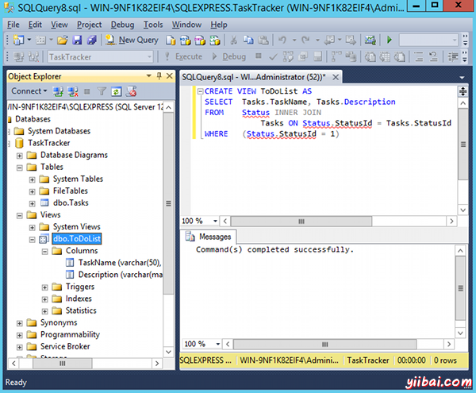
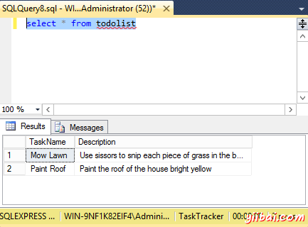

# SQL Server视图 - SQL Server教程

在SQL Server中，视图是被存储在数据库中的预写查询。视图是由一个SELECT语句，当你运行视图，会看到它的结果，就像打开一个表时一样。 有些人喜欢把视图称作为虚拟表。这是因为，一个视图可以拉动多个表，并汇总数据在一起并将其显示，就好像它是一个单一的表。

## 视图的优点

当有多个用户提供不同级别的访问权限，需要看到在数据库中(但不一定是所有数据)中的数据的各不同部分的视图，可能是有用的。视图可以执行以下操作：

*   限制访问特定的表中的行
*   限制访问特定的表中的列
*   从多个表中加入列，并呈现出来，好像他们是一个单一的表的一部分
*   呈现汇总的信息(如COUNT函数的结果)

## 视图语法

创建一个视图通过使用CREATE VIEW语句，其次是SELECT语句。


```
CREATE VIEW ViewName AS
SELECT ...
```

## 创建视图

我们以前使用的查询设计器创建两个表中选择数据的查询。现在让我们在查询并将其保存为一个名为“ToDoList”的视图。基本上，我们需要做的就是把CREATE VIEW ToDoList的AS查询，像这样的面前：


```
CREATE VIEW ToDoList AS
SELECT	Tasks.TaskName, Tasks.Description
FROM	Status INNER JOIN
			Tasks ON Status.StatusId = Tasks.StatusId
WHERE	(Status.StatusId = 1)
```

一旦运行该脚本，刷新浏览文件夹在左窗格中，你会看到视图就在左窗格中：



## 运行视图

所以，现在你已经创建的视图，你可以简单地查看结果选择它就像你会选择任何表。而不是输入出大SELECT语句的INNER JOIN等等，可以简单地键入select* from todolist，它会运行完整的查询：


_注：_也可以在视图上单击鼠标右键，并选择 "Select Top 1000 Rows".

## 数据更新

该视图将返回最新的数据。如果表中的数据发生变化时，视图的结果会改变过。所以，如果要添加新任务以及状态 "To Do", 下一次运行来看，这将包括在结果集中的新纪录。

## 修改视图

可以通过使用ALTER而不是CREATE修改现有的视图。

因此，如果我们想要更改视图使用StatusName字段，而不是StatusId，我们可以这样做：


```
ALTER VIEW ToDoList AS
SELECT	Tasks.TaskName, Tasks.Description
FROM	Status INNER JOIN
			Tasks ON Status.StatusId = Tasks.StatusId
WHERE	(Status.StatusName = 'To Do')
```

_注：_使用查询设计器也可以右键单击视图，然后选择设计来修改您的视图。

正如你所看到的，视图让您保存查询，以便可以做一个SELECT，再次运行它也会比较简单。但它们的确有其局限性。它们允许选择数据，但不允许执行任何业务逻辑，如条件语句等。 要做到这一点需要一个[存储过程](http://www.yiibai.com/sql_server/sql_server_stored_procedures.html)。 

