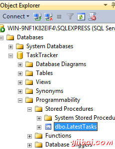
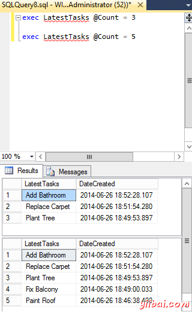
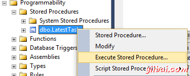
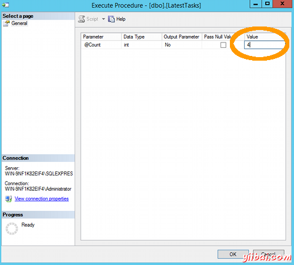

# SQL Server存储过程 - SQL Server教程

在SQL Server中，存储过程是比视图更强大。视图让我们简单地做一个SELECT查询也在可视图本身，它的工作方式是用于运行复杂的查询。 但视图并不姝真正为我们提供代码业务逻辑的能力。例如，视图不会能让我们增加条件代码(如IF语句)。幸运的是存储过程可能使用。

## 什么是存储过程？

存储过程是一组SQL语句编译成一个SQL。类似于在说的SQL脚本页面，在这里可以运行许多SQL脚本合为一个整体。

然而，存储过程并不仅仅是一个长脚本。这是已保存在SQL Server中明确在存储过程节点的脚本。存储过程通常包含一些业务逻辑。 例如，一个存储过程可以接受被传递给它的并针对这些参数测试使用IF语句的参数。例如，如果该参数是一个值，这样做，如果它是另一个值。

它们包含业务逻辑的能力使存储过程SQL Server的强大的一部分。存储过程可以提高性能的应用程序，因为存储过程进行解析，并尽快，因为它是建立优化，然后存储在内存中。运行通过存储过程条件的查询可以是非常快 - 相比，发送查询通过网络，到SQL Server的应用程序，遂将全部返还给它在网络上，因此它可以过滤通过它，并挑选出只是它感兴趣的记录数据。

## 存储过程的好处

下面是一些在使用存储过程的主要优点：

| 好处 | 说明 |
| --- | --- |
| 模块化编程 | 可以写一个存储过程一次，然后一次又一次地调用它，从应用程序的不同部分（甚至多个应用程序）。 |
| 性能 | 存储过程提供更快的代码执行和减少网络流量。更快的执行：存储过程进行解析，并为他们创造尽快优化和存储过程是存储在内存中。这意味着它会执行比从应用程序到SQL Server发送SQL多行代码快了很多。这样做需要SQL Server来编译和每次运行时优化改进你的SQL代码。减少网络流量：如果通过网络发送的SQL多行代码到你的SQL Server中，这会影响网络性能。如果你有数以百计的SQL代码行和/或你有很多活动在应用程序，这是尤其如此。运行SQL Server上的代码（作为存储过程中）消除了需要发送此代码在网络上。唯一的网络通信将提供的参数和任何查询的结果。 |
| 安全 | 用户无需执行任何直接的语句可以执行存储过程。因此，存储过程可以谁也不能正常访问这些任务的用户提供先进的数据库功能，但这种功能是在严格控制的方式提供。 |

## 创建一个存储过程

要创建一个存储过程，需要使用CREATE PROCEDURE语句，其次是弥补了存储过程的代码。如果存储过程将要接受参数，它们需要被包括在名称后。


```
CREATE PROCEDURE myStoredProcedure AS
...

OR

CREATE PROCEDURE myStoredProcedure @{Parameter Name} {data type} AS
...
```

### 示例

下面的代码创建一个存储过程被称为“LatestTasks”。它接受一个参数名为 @Count. 当调用这个存储过程，通过@count参数，它决定你想要多少行返回。下面的代码：


```
CREATE PROCEDURE LatestTasks @Count int AS
SET ROWCOUNT @Count
SELECT TaskName AS LatestTasks, DateCreated
FROM Tasks
ORDER BY DateCreated DESC
```

运行这段代码在SQL Server管理套件，会看到它被在存储过程节点创建为“LatestTasks”。



在SQL Server2014，可以在存储过程节点/文件夹中创建通过右键单击一个存储过程，选择存储过程....这将打开一个模板，这是随时可以填入自己的具体程序。

## 执行存储过程

现在，已经创建了存储过程，要执行它的任何时间，需要使用调用它要么执行或EXEC。如果存储过程的参数要求提供这些程序名在后面。像这样：


```
EXECUTE LatestTasks 
EXEC LatestTasks

EXEC LatestTasks @Count = 5
```

### 示例

在下面的例子中，我们在同一时间执行存储过程两次。我们第一次调用它，我们通过@Count传递为3，第二次传递的值为5。

该截图显示，通过传递参数（和值），存储过程返回结果的基础上提供值。顶端结果集返回3行，因为我们通过值3。第二个结果集返回5行，因为我们提供一个值5：



### 使用GUI

还可以使用图形用户界面来执行存储过程。

具体方法如下：

1.  使用对象资源管理器，浏览到存储过程
2.  右键单击该存储过程并选择 Execute Stored Procedure...: 
3.  会出现一个对话框。输入您所选择的参数值： 
4.  点击 OK
5.  SQL Server现在会生成SQL代码并执行存储过程。

## 修改存储过程

如果需要修改现有的存储过程，只需更换CREATE使用ALTER。 让我们添加一个空格之间“Latest”和“Tasks”（即“Latest Tasks”），并添加描述字段：


```
ALTER PROCEDURE LatestTasks @Count int AS
SET ROWCOUNT @Count
SELECT TaskName AS "Latest Tasks", Description, DateCreated
FROM Tasks
ORDER BY DateCreated DESC
```

## 系统存储过程

SQL Server包含了大量的系统存储过程，以帮助数据库管理任务。可以通过GUI执行的任务可以通过系统存储过程来完成。 例如，有些东西可以用系统存储过程的包括：

*   配置安全帐户
*   建立链接服务器
*   创建一个数据库维护计划
*   创建全文检索目录
*   添加远程登录
*   配置复制
*   设置调度作业
*   以及更多...

## 命名约定

扩展系统存储过程节点，一起来看看。会发现，他们的名字都开始以sp_，表明它是一个存储过程。该系统存储过程显然遵循的命名约定。

这是一个好主意，制定一个一致的命名约定存储过程（并为数据库中的所有其他对象）。

有些人前缀的存储过程usp_，另外其他人使用SQL关键字，如SELECT，INSERT，UPDATE，DELETE。其他人使用的缩写应用。

一些使用下划线的存储过程（例如，latest_tasks）在单独的单词，而其他人将使用标题的情况下（例如，LatestTasks）。

因此，这是可能的，我们的存储过程可以被命名为以下任意一种，这取决于命名约定的使用。

*   LatestTasks
*   latest_tasks
*   uspLatestTasks
*   usp_latest_tasks
*   selectLatestTasks
*   select_LatestTasks
*   select_latest_tasks
*   getLatestTasks
*   get_latest_tasks

最重要的是一致性。选择一个，并坚持下去。它会更容易，当你需要使用存储过程。 想象一下，有几十，甚至上百的存储程序，每一次执行一次，需要找到它在对象资源管理器，是否把它称为usp_LatestTasks或uspLatestTasks。

所以这是存储过程覆盖。接下来，我们了解[用户登录](http://www.yiibai.com/sql_server/sql_server_user_logins.htm)。

