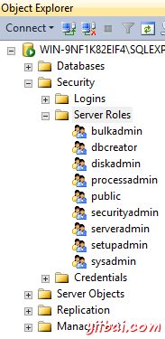

# SQL Server服务器角色 - SQL Server教程

当我们创建一个SQL Server登录，我们必须分配登录的一个或多个服务器角色的选项。

服务器角色(不要与数据库角色混淆)可用来管理服务器上的权限。不是每个人都应该分配给服务器的角色。只有高级用户，如数据库管理员应指定一个服务器角色。

## 查看服务器角色

要查看在SQL Server2014管理Studio服务器角色，在对象资源管理器，展开安全文件夹：

SQL Server 2014提供了九个固定服务器角色。被授予到固定服务器角色的权限，不能更改。

## 九层固定服务器角色的说明

下面是安装过程中在SQL Server2014中定义的服务器角色的解释：

| 服务器角色 | 描述 |
| --- | --- |
| sysadmin | 可以在SQL Server中执行任何活动。 |
| serveradmin | 可以设置服务器范围的配置选项和关闭服务器。 |
| setupadmin | 可以添加和使用Transact-SQL语句删除链接的服务器。 （使用SQL Server管理套件，当系统管理员成员需要。） |
| securityadmin | 可以管理登录及其属性。他们可以GRANT, DENY和REVOKE服务器级别的权限。他们还可以GRANT, DENY和REVOKE数据库级别的权限，如果他们有机会获得一个数据库。 他们还可以重置SQL Server登录密码。 |
| processadmin | 可以结束了在SQL Server实例中运行的进程。 |
| dbcreator | 可以创建，修改，删除，并恢复所有数据库。 |
| diskadmin | 可以管理磁盘文件。 |
| bulkadmin | 可以执行BULK INSERT语句。 |
| public | 每一个SQL Server登录属于公共服务器角色。当一个服务器主体没有被授予或拒绝对受保护对象的特定权限，用户继承对象授予public权限。只有当你想提供给所有用户对象上的任何对象分配公共权限。不能改变的成员在公共权限。 |

一些这些角色允许执行非常特定的任务。如果只有一个小团队，很可能只使用其中的一个角色（包括系统管理员）的两个。如果有一个大的团队，那么可以使用它们。

在SQL Server2014（和SQL Server2012），可以创建用户定义的服务器角色，并添加服务器级别的权限用户定义的服务器角色。

接下来我们来看看[数据库模式](http://www.yiibai.com/sql_server/sql_server_database_schemas.htm)。

