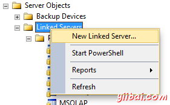
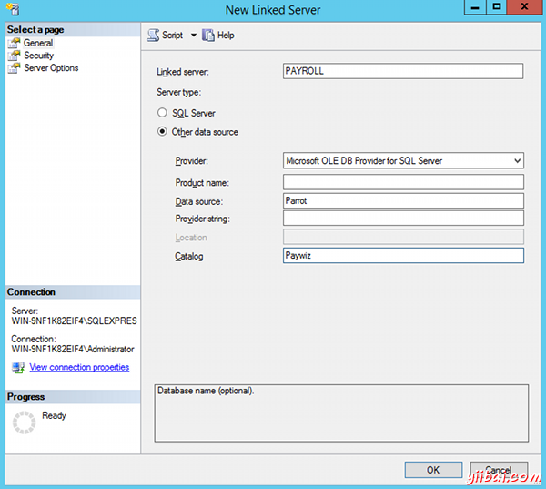
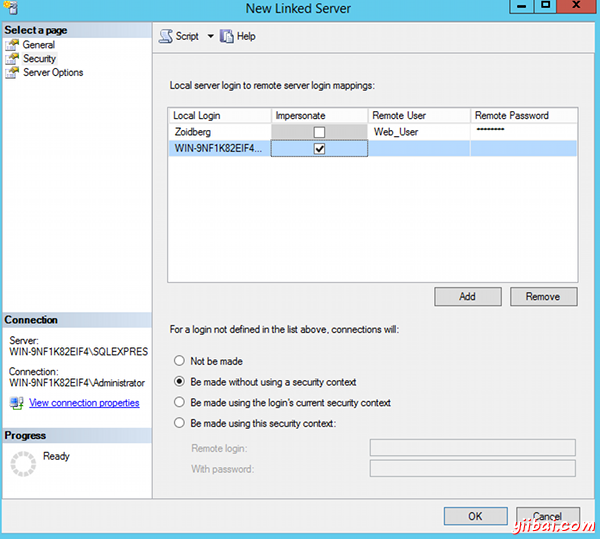
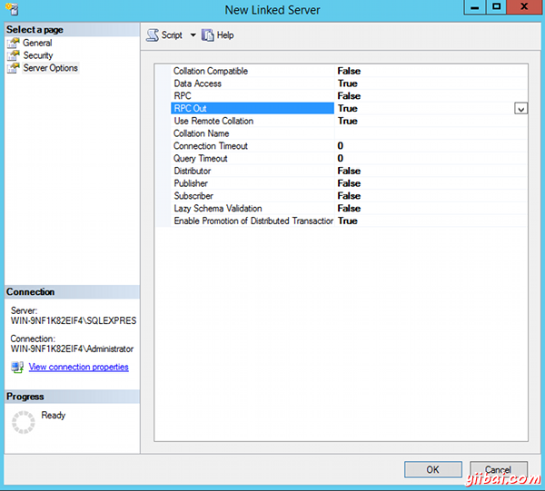
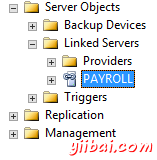

# SQL Server链接服务器 - SQL Server教程

SQL Server提供链接到另一个服务器的选项。这通常被用来连接到其他SQL Server数据库，但它也可以被用来连接到一个Microsoft [Access数据库](http://www.yiibai.com/access/)。这是通过链接服务器节点成为可能。

链接服务器节点可以连接到另一个数据库，通常/通常在不同的机器上运行，远程也许在不同的城市/国家。如果您需要执行分布式查询(查询远程数据库)，这可能是有用的。 设置链接服务器就是相当于使用简单的SQL Server管理套件。 所有需要的就是查询远程服务器的详细信息，以及数据库。

## 创建链接服务器

要创建链接的服务器：

1.  在对象资源管理器，打开服务器对象，并导航到链接服务器
2.  右键单击链接服务器，然后选择 New Linked Server...: 
3.  填写详细链接服务器的信息。 在本例，我连接到SQL Server称为Parrot的远程服务器，上面有一个为Paywi的z数据库。链接服务器名称是PAYROLL: 
4.  根据安全性选项，必须向本地用户映射到用户在远程机器上的能力。在这里，本地SQL Server用户Zoidberg被映射到远程机器上的Web_User帐户。这里提供的密码必须是Web_User帐户的远程计算机上的密码。我们也有一个本地Windows域身份验证的用户映射到同一个用户在远程机器上，并设置为模拟。 Windows域身份验证的用户也是远程计算机上，因此本地用户可以简单地模拟远程用户： 
5.  并且服务器选项可让您进一步配置为链接服务器。在这里我换了一个环境。我设置RPC输出为True。此选项使用户能够对运行链接服务器存储过程。需要注意的是在RPC选项可以存储从远程服务器到本地机器称为程序。在这种情况下，我们已经离开并且为False： 
6.  当配置时，单击确定以创建链接的服务器。

现在应该看到新的链接服务器坐在对象资源管理器的链接服务器节点下。



## 分布式查询

当配置了链接服务器，将能够运行查询等。当您运行链接服务器查询，它被称为分布式查询。

当您执行对链接服务器的分布式查询，则必须包括每个数据源来查询一个完全合格的，由四部分组成的表名。这四部分的名称应该是形式 linked_server_name.catalog.schema.object_name.

下面是一个例子：


```
SELECT * FROM PAYROLL.Paywiz.dbo.Employees
```

这个例子是基于上面的链接服务器的例子。它假定远程数据库有一个名为“dbo”模式和一个名为“Employees”表。